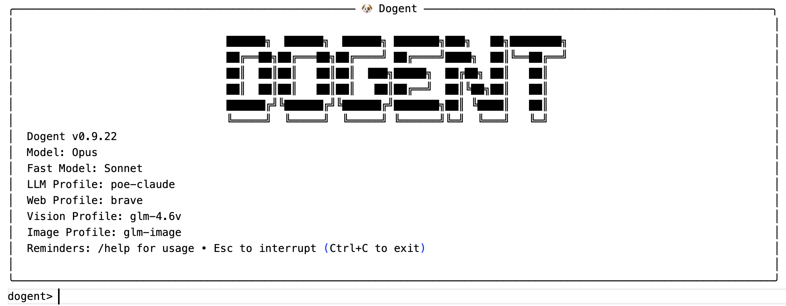

# Dogent 的诞生：从 Vibe Coding 到 Vibe Writing

作为一名顾问，我经常需要撰写各种技术文档。这个过程中自然少不了借助 AI 来辅助调研、润色、排版与校对。

然而，AI 协助的专业文档写作有其独特的挑战：需要精心设计的提示词，需要让 AI 参考给定的知识，遵循指定的文档模板，还需要反复迭代和调优。这些工作如果使用在线 LLM 助手，往往需要反复粘贴提示词、上传文件，效率很低；而使用本地 Agent 助手（如 Claude Code 或 Codex）则会发现另一个问题：**这些专注 Coding 的 Agent，其交互设计并不适合写作，输出技术文档也充满了 "AI 味道"**: 过于结构化的短句、泛滥的项目符号列表、缺乏叙事张力的表达……

这首先源于系统提示词的错配。编码 Agent 的系统提示词是专门为编程场景设计的。看看 [Codex 的源码](https://github.com/openai/codex) 中的系统提示词就知道，它强调的是代码风格一致性、工具使用规范、Git 操作安全这些工程化约束。这种设计导致生成的文本天然带有 "Coding 风格"：喜欢用列表、偏好结构化输出、优选 `mermaid` 风格的图表、追求明确性而非可读性 —— 浓浓的 "AI 味道" 就是这么来的。

而专业写作需要的是另一套东西：叙事的连贯性、读者导向的表达、符合特定文体的语气。技术博客需要轻松易懂，设计文档需要严谨详实，技术报告需要权威可信。这些要求，绝不是在 prompt 里加一句 "请写得生动一点" 就能解决的。

Coding Agent 的另一个问题在于，其交互方式与写作场景脱节。写作和编码有着本质不同的工作节奏：写作时往往需要在 CLI 中进行多行输入；确认大纲结构时需要能在终端里直接调出编辑器进行可视化修改；不仅要能引用文件，还要能够指定文档模板……更重要的是，写作过程不像编码那样具有清晰的编译和测试 "反馈信号" 可以一定程度自循环，**而写作缺乏清晰的自校验反馈信号，需要人持续参与校对，因此也需要更匹配的人机协同交互方式**。

此外，专业写作需要一套特定的工具链：直接读取和生成 PDF、DOCX、XLSX 文件，分析图表，进行网络调研（Claude Code 的 Web Search 在国内用不了），定制 PDF 生成样式……这些能力需要内置到 Agent 之中，才能让写作流程顺畅高效。

正是基于这些原因，Dogent（一个专注于协助写作的 AI Agent）的想法诞生了：与其继续调教一个 "Coding Agent" 去写文档，不如构建一个 **"写作优先" 的专业 Agent**。

为了能够 "一鱼两吃"，我决定完全用 Vibe Coding 的方式来开发 Dogent。这样既能产出一个实用的写作工具，也方便我顺便做一系列实验，验证当下最先进的 AI Coding Agent 的代码能力，检验各种 AI 辅助软件开发实践的实际功效：包括 AI 辅助原型设计、Spec 驱动开发、可观测性设计、面向 Context 的设计与重构、AI 时代的架构原则……

因此，Dogent 是一个完全用 Vibe Coding 方式 "攒" 出来的工具。整个开发过程使用 Codex CLI 配合 GPT-5.2 High 模型，我几乎没有手写过一行代码。

---

## 技术选型的两个决策点

Dogent 的开发过程涉及两个关键的技术选型决策，它们背后的考量值得展开说说。

**第一个决策：为什么用 Codex 做 Vibe Coding？**

整个 Dogent 是用 Codex CLI 配合 GPT-5.2 High 模型，以完全 Vibe Coding 的方式开发的。选择 Codex 的原因很直接：具备精准的**人机协作分寸感**，"干脆利落"，从不 "拖泥带水"，配合 GPT-5.2 High 这个模型，实现意图的还原度与协作体验俱佳。

**第二个决策：为什么 Dogent 本身要基于 Claude Agent SDK 开发，而不是直接用 Codex SDK？**

这个选择背后的主要原因是 Claude Agent SDK 的可开发性更好。Codex 虽然开源，源码完全可以看，端到端体验不错，但它的 SDK 编程接口和用户文档都还比较初期。相比之下，Claude Agent SDK 官方提供的 API 和文档非常丰富和完善，可配置性很强，能满足开发一个动态 Agent 的各种定制需求。

由此可见，**端到端的工具**（比如 Codex 作为用户直接使用的编码助手）选型的重点在于使用体验；而**可开发 SDK**（比如用来构建其他 Agent 的 SDK）选型的重点是 "可开发性"，两者的评价标准截然不同。

这里也印证了一个**可开发性原则**：对 "可开发性软件" 来说，"可协作的契约" over "代码开源"。一个开源项目把所有代码都公开了，并不意味着其他开发者就能基于它高效地构建东西。真正重要的是：有没有设计良好的功能完备的 API？有没有清晰和丰富的文档？接口设计是否稳定？这些 "契约" 层面的东西，比源码本身更决定一个 SDK 的可开发性。

---

## 吃自己狗粮的开发过程

Dogent 的开发过程本身是一个有趣的闭环实验，基本是我利用工作的碎片化时间，采用 "吃自己狗粮" 的方式进行的。

我经常同时打开两个终端窗口：一边用 Dogent 撰写技术文档，同时后台让 Codex 开发 Dogent 的新功能。写文档时发现哪里不好用，就切到 Codex 加功能；功能开发好了，回到 Dogent 继续写文档测试新功能。

这种 "吃自己狗粮" 的模式有几个好处。

首先，**需求永远是真实的**。不是想象中用户可能需要什么，而是我自己此刻确实需要什么。这避免了很多过度设计。

其次，**反馈循环极短**。发现问题到解决问题可能就几分钟的事情，不需要等到下个版本。

最后，**验收标准很明确**：能不能让我更顺畅地完成当前的文档撰写？

当然，这种模式也有它的局限。我一个人的需求终究是片面的，做出来的工具可能过度拟合我的使用习惯。但对于一个服务于自己和几个同事的长尾工具来说，这个问题并不严重。

---

## Dogent 能做什么

基于前文所述，通过持续的 "吃自己的狗粮"，[Dogent](https://github.com/MagicBowen/dogent) 逐步演化出了一套适合我这样的软件工程师的写作习惯的功能集。

**定制的系统提示词与写作最佳实践**：Dogent 的系统提示词是专门为长文档撰写设计的，强调叙事连贯、风格一致、逻辑递进。它会尽量避免编码 Agent 那种碎片化的输出习惯。

**文档模板体系**：支持三层模板结构 —— 内置模板（随包发布的基础框架）、全局模板（用户自定义的跨项目复用模板）、工作区模板（项目特定的深度定制）。使用时可以通过 `@@template_name` 临时指定输出模板，也可以在项目配置中设置默认模板。

**终端写作体验**：CLI 交互中集成了即时 Markdown 编辑器，按 `Ctrl+E` 调出多行编辑器，按 `Ctrl+P` 进行 Markdown 即时预览。支持 `Esc` 中断当前任务、快捷键和命令补全。这个场景满足了软件工程师习惯以 CLI 作为界面的特点，又缓解了 CLI 下不适合跨行 markdown 编辑和 review 的痛点（适合快速编辑和预览篇幅不长的多行文本或者 markdown，更长的还是适合 UI 编辑器）。

**多格式文档处理**：通过 `@file` 引用本地文件作为上下文，支持 PDF、DOCX、XLSX、纯文本等格式。Excel 可以通过 `#Sheet` 指定工作表。输出方面支持 Markdown 到 DOCX 的转换、Markdown 到 PDF 的导出，PDF 样式可以通过 CSS 模板定制。

**视觉内容理解与生成**：通过配置视觉模型 profile，支持图片和视频的内容分析，也可以基于文本提示生成配图。

**Lessons 经验沉淀**：当 Agent 执行失败或者用户主动中断任务时，可以记录经验教训。后续任务会自动带上相关的 lessons，避免重复犯错。这其实是把 "人对 AI 的纠错反馈" 从一次性的对话，变成了可持续复用的结构化资产。

**项目状态文件化**：history、memory、lessons 都持久化存储在 `.dogent/` 目录下。可以通过 `/show` 查看、`/archive` 归档、`/clean` 清理。这让长周期的写作项目可以随时中断和恢复。

**可配置的搜索服务**：针对国内 Claude Code 的 Web Search 不可用的问题，支持用户配置 Google CSE、Bing、Brave 等第三方搜索服务。

**Claude 生态兼容**：可以复用 Claude Code 的 commands、plugins、skills，共享 CLaude Code 生态。例如对于 PPT 生成，目前缺乏系统性的 "完美解决方案"，用户可以直接安装 Claude Code 现成的 PPTX skill 作为过渡。

坦白说，这些功能单独拿出来都不复杂。但把它们整合成一个针对写作场景优化过的完整体验，对我这个特定用户来说，确实比直接用 Claude Code 舒服很多。

---

## 两个维度的收获

通过 Vibe Coding 的方式开发 Dogent，让我获得了两个维度的经验和思考。

**第一个维度是关于如何设计和开发一个动态 Agent**。这包括：对于动态 Agent 来说 Prompt 工程的要点是什么、如何管理好复杂的上下文、如何让 Agent 从错误中学习持续改进、如何提高 Agent 的容错性避免 LLM 的指令遵从问题。这些内容我会在后续的文章中展开。

**第二个维度是关于 Vibe Coding 本身的方法论思考**。当完全依赖 AI 来写代码时，什么时候需要引入 Spec，价值到底有多大？可观测性设计与架构解耦的优先级是什么？人的角色从 "代码编写者" 转变为 "需求澄清者" 和 "架构监督者" 后，复杂度转移到了哪里？AI 友好的软件架构的原则是什么？这些问题在 Dogent 的开发过程中做了一些针对性的验证，也会在后续的文章中专门展开。

这两类经验互相交织。开发 Agent 的过程验证了 Vibe Coding 的可行边界；Vibe Coding 的实践又反过来影响了 Agent 的设计思路。

---

## 关于这几篇博客

在 AI Coding 时代，工具软件的开发成本正在急剧下降，一个周末就能攒出一个功能完备的小工具。这意味着 "长尾工具" 会大量涌现 —— 这些工具可能只服务于几个人，解决一个非常具体的问题，但正因为足够具体，所以用起来顺手。

Dogent 正是如此，它算基于 Claude Agent SDK 之上的 "套壳" 工具，开发门槛不高，价值也很朴素（主要就是服务我自己，以及周围几个有类似写作需求的同事），因此工具本身没有太多值得书写的。

然而，开发 Dogent 的过程则印证了一个越来越明确的趋势：在 AI Coding 时代，软件的开发门槛正在急剧降低，"随手可得" 正在成为常态。**真正稀缺的不再是代码本身，而是能够洞察需求、融入业务上下文的创意和判断力**。

当 AI 越来越能干，人的要求会更 "细致"，体验会更 "挑剔"，选择会更偏向 "品味" 与 "体验"。这是一种进步：技术可以更快地对齐目标。而我们终于可以稍稍告慰自己：**人是目的，不是过程，也不是工具。**

所以，AI 时代很多关键问题，靠 "生成" 解决不了，必须靠 "判断" 解决。而判断力来自长期积累：见过、做过、踩过坑，有审美，懂平衡，并持续的审视与反思。这几篇博客正是对此的记录，希望能对读者有所启发。
