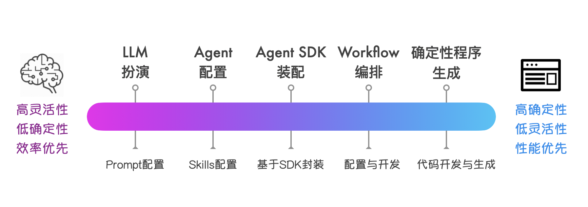

# AI Agent 时代的软件技术栈选型：从 "扮演" 到 "生成"

AI Agent 的兴起，让工具软件的技术栈选型变得逐渐多元化。过去开发一个工具，技术栈选型主要聚焦于用什么语言、什么框架、什么数据库。而现在思考的角度变了：是让通用 Agent 直接 "扮演" 这个工具？还是基于 Agent SDK 开发定制化的 Agent 代理？还是开发或生成确定性 APP？又或者，把这几种方案混合使用？

这些选择并非非此即彼，而是构成了一个技术栈选型的 "光谱"。这个光谱反映了 AI 时代软件开发技术栈的结构关系和平衡策略。

---

## 技术栈光谱

把当前可用的技术方案按照从 "灵活性" 到 "确定性" 从左到右进行排列，大致可以分成如下几个主要分界点：

**1：让 LLM "扮演"**

最轻量的方案是直接通过精心设计的 Prompt，让通用大语言模型临时扮演特定角色。这不需要写任何代码，只需要设计好系统提示词。有点像请一个什么角色都能演的 "天王级演员"：今天演科学家，明天演艺术家，一个人撑起整台戏。

一个经典的例子是 [Mr.-Ranedeer-AI-Tutor](https://github.com/JushBJJ/Mr.-Ranedeer-AI-Tutor)，它通过复杂的 Prompt 工程，让 ChatGPT 扮演一个可定制的 AI 家教。用户可以选择学习风格、深度、语气，AI 就按照设定来教学。此外，李继刚通过 Prompt 技巧让 Claude 生成的各种有趣的即时网页应用，也颇为流行。

虽然这种 "扮演" 能力目前能覆盖的软件范围有限，但随着 LLM 能力的持续提升，这种方式会越来越强大，能够胜任越来越复杂的任务。

这种方案的优势是**开发成本极低、即时可用、非常灵活**。想改变行为？改 Prompt 就行。缺点也很明显：行为不可完全预测，受限于模型的上下文窗口，每次对话都需要重新 "进入角色"，而且推理成本不菲 —— 天王级演员的片酬从来不便宜。

**2：配置通用 Agent "扮演"**

进一步的方案是在通用 Agent（比如 Claude Code）的基础上进行配置和扩展。通过定制系统提示词、设置项目级的规则、配置专用工具集和 Skills，把通用 Agent "改造" 成一个领域 APP。

这其实是很多人使用 Claude Code 的方式：在项目的 `.claude/` 目录下放置配置文件，定义 skills 和 commands，让 Claude Code 能够胜任某些领域的特殊需求。

配置化扮演的威力比很多人想象的要大。举个例子，你完全可以通过配置 Claude Code，定制出各种 CLI 应用：比如一个发票助手，有自己的子命令、技能和规则。用户在终端里输入 `/invoice scan`，Agent 就知道要扫描当前目录的发票图片并提取信息。这类应用基本都可以由通用 Agent "扮演" 出来，几乎不需要写代码（除了 Skill 中的胶水代码）。

更值得关注的是 GUI 应用的扮演潜力。当 Google 的 A2UI（Agent-to-UI）这类技术成熟后，通用 Agent 将能够直接生成并操作图形界面，扮演各种 GUI 应用。至少在原型验证阶段，很多工具型应用都可以采用这种方案：**不是开发一个 App，而是让 Agent 扮演一个 App**。

**3：基于动态 Agent SDK 开发**

当配置已经无法满足需求时，下一步是通过封装 Agent SDK 构建一个专用 Agent。Dogent 就处于这个层级。

这种方案往往适合以下场景：需要定制化的系统提示词、定制化的交互方式和 UI 界面、自定义的内置工具集，以及需要与其它工具和系统进行深度集成的情况。

Claude Agent SDK 属于这类动态 Agent SDK。它提供了 Agent 的核心能力：LLM API 对接、工具使用、对话管理、上下文维护，但把系统提示词、交互方式、工具集成都开放给开发者定制。

这个层级的特点是面向领域定制的 "动态规划"：Agent 可以根据领域特点更精细地进行决策和执行。这种定制能力对于体验敏感的任务（比如写作、设计）以及深度集成的系统（比如 CI/CD）特别重要。代价是开发成本：你需要写代码、需要理解 SDK 的工作方式、需要持续维护。

**4：静态编排类 Agent**

如果任务的流程相对固定，可以用静态工作流来替代动态规划。字节的 COZE 平台、LangGraph 等都是这种思路：预先定义好执行步骤和分支条件，Agent 按图索骥地执行，在特定阶段按需调用 AI 的能力。

这种方案的确定性更高，更容易审计和调试，但灵活性受限 —— 如果任务超出预设的流程，系统要么无法处理，要么需要人工介入。

**5：传统确定性程序**

光谱的另一端是完全没有 AI 参与的传统软件，所有逻辑都是确定性的，用代码硬编码。这就像建一条生产流水线：预先设计好每个环节，让每个工序只负责一个固定动作。前期投入大，但一旦跑起来，效率高、成本可控、质量稳定。

这并非一个过时的选项。当需求完全明确、规则完全固定、对性能和稳定性要求极高时，传统程序仍然是最优解。不过，这类程序未来会逐渐变成 AI Agent 的手和脚，帮 Agent 执行那些确定性强、重复性高的阶段任务。

---

## 开发效率与性能成本之间的权衡

上述技术栈选型谱系应该是一个连续谱系，所谓的分界点只是标注了一些典型的技术栈选型，它们中间可以有很多过渡形态的技术选型。

光谱左边是 **"开发效率优先"**。零代码、即时可用、快速迭代。想验证一个新想法？让 Agent 扮演一下就知道行不行。修改需求？改几行配置就生效。这种模式特别适合原型验证、低频使用、快速实验的场景。

光谱右边是 **"性能与成本优先"**。前期投入开发成本，换来 "极致" 的性能与成本：响应时间可预测，资源消耗可控制，更好的稳定性和可控性。这种模式适合高频使用、关键路径、行为确定性场景。

中间的阶段则是各种折中。动态 Agent SDK 牺牲一些开发效率换取更多定制空间；静态编排 Agent SDK 牺牲一些灵活性换取更多确定性。

不过值得注意的是，随着模型和动态 Agent SDK 能力的增强，这个光谱的左边变得前所未有的强大。目前必须 "开发" 的功能，未来逐步都可以用 "扮演" 来解决。

这并不意味着右边的技术方案会消失 —— 恰恰相反，**当 "扮演" 变得足够便宜时，"开发" 的门槛反而会提高**：只有那些真正需要极致体验、性能、确定性的场景，才值得投入开发成本。

软件的技术选型，最终是一个体验、效率与性能成本的综合考量，优秀的系统往往在光谱两端之间找到恰当的平衡点。

---

## 快速原型与渐进式固化

AI Agent 的 "扮演" 能力，让快速原型变得更加容易，使需求验证和价值确认可以先行，真正有价值的功能再投入开发 —— 这让软件开发更加敏捷和精益。

当新想法刚出现时，先用最灵活的方式验证，在光谱上从左往右找到最合适的起点，经过原型验证后，再根据需求的稳定性和使用频率，逐步向右移动。

例如在概念验证阶段，可以从配置通用 Agent 开始，通过定制规则、设置工具和技能，验证核心概念是否成立、目标用户是否接受。

如果某些功能变得足够稳定和高频，可以把它们从动态 Agent 中抽离出来，做成静态流程甚至传统代码，进一步提高性能和可靠性。

整个过程的关键在于：**AI Agent 让想法更快地得到反馈和闭环**。先用最快的方式验证想法，再根据实际情况决定要不要向右移动、移动到哪里。

以前我们开玩笑说 "好的软件就得做两遍"，现在有了 AI Agent，做两遍的成本大大降低了。甚至一上来就该抱着做两遍的心态：第一遍使用 AI Agent "扮演" 进行快速原型验证，等到核心逻辑跑通、价值点被验证成立，再进行第二遍工程化落地，决策最终的技术架构和性能成本。

---

## Dogent 的技术栈选型位置

回到 Dogent 的技术选型。为什么不直接配置 Claude Code（分界点 2），也不做成静态工作流（分界点 4），而是选择基于 Claude Agent SDK 开发（分界点 3）？

配置 Claude Code 的问题在于：写作场景需要的定制程度超出了配置能提供的范围。系统提示词不能完全控制，交互方式（比如大纲编辑器）无法定制，工具集成（比如 PDF 生成、自定义视觉分析）不够深入。

静态工作流的问题在于：写作是创造性活动，流程无法预先确定。用户可能随时改变文章结构、插入新素材、调整论证逻辑。这不是一个可以画成流程图的任务。

因此，动态 Agent SDK 成了合适的选择。它提供了足够的定制空间，又保留了处理不确定性的能力。开发成本介于 "配置" 和 "从零开发" 之间，对于一个需要持续迭代的写作工具来说，是一个恰当的平衡点。

---

## 复杂系统软件：从确定性架构走向混合架构

实际的复杂系统通常不会只停留在光谱的某一点，而是在不同模块采用不同层级的方案，这是务实的平衡策略。

以一个典型的企业级 AI 应用为例：用户交互层可能采用动态 Agent SDK（分界点 3），因为用户需求千变万化，需要灵活应对；数据处理管道则是静态工作流（分界点 4），确保 ETL 流程的可预测性和可审计性；核心业务规则用传统代码硬编码（分界点 5），保证关键路径的性能和稳定性；而一些边缘功能，比如智能客服的话术优化，可能直接复用通用 Agent 的能力（分界点 2），省去专门开发的成本。

这种混合架构的设计原则是：**在正确的地方使用正确的技术**。需要创造性和灵活性的地方，用光谱左边的方案；需要确定性和高性能的地方，用光谱右边的方案。关键路径要稳，边缘场景要灵。

即使对于嵌入式设备，未来我相信也会普遍内置一个低资源消耗的 Agent 引擎加一个嵌入式模型推理引擎，这可能会成为软件平台的标配。

AI Agent（SDK）的出现，让技术选型的空间变得更加丰富 —— 我们有了更多的选择，也需要更精细的判断。
