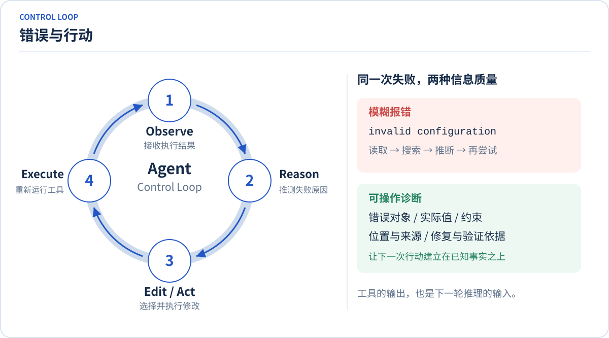
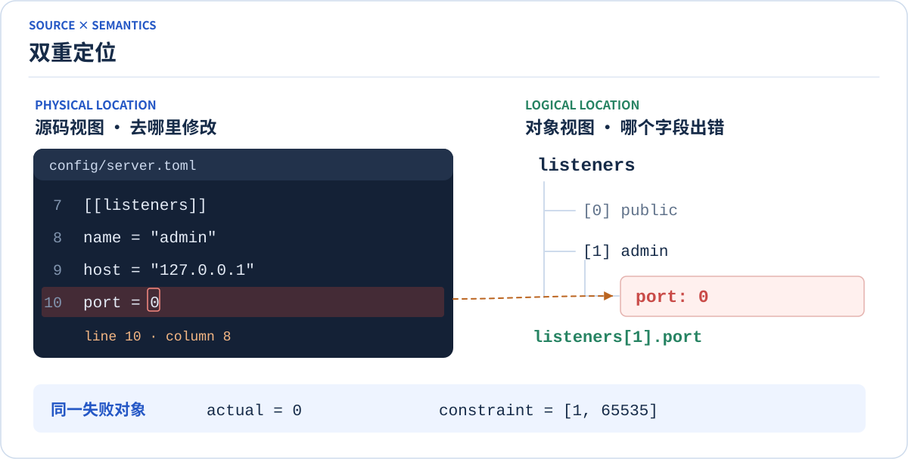
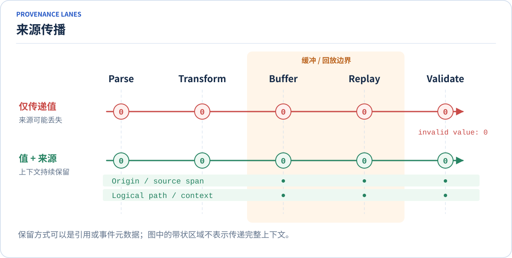
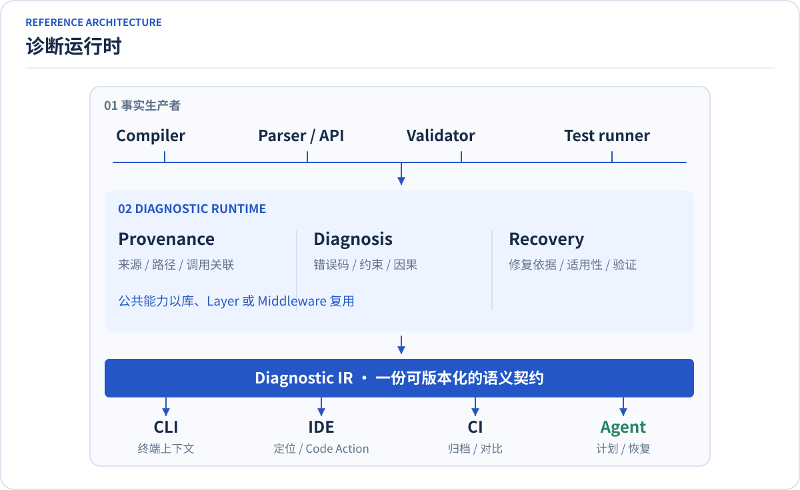
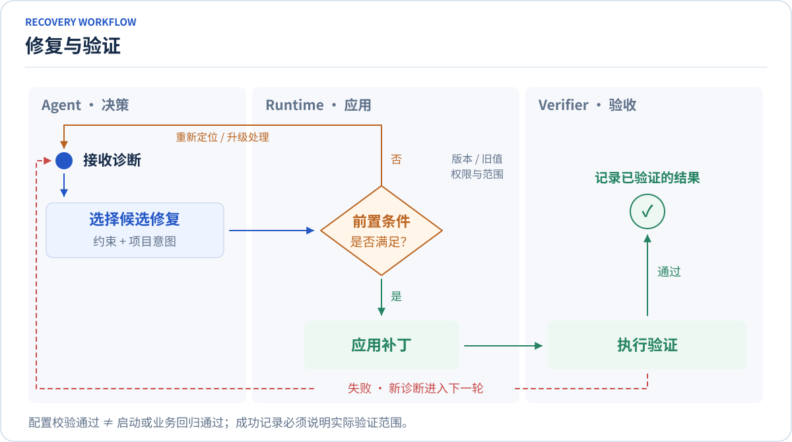
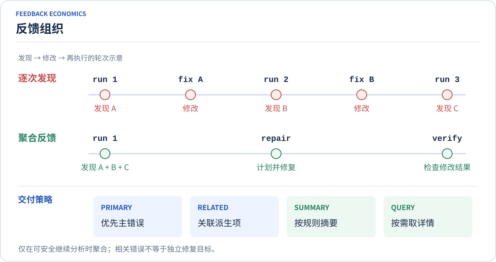
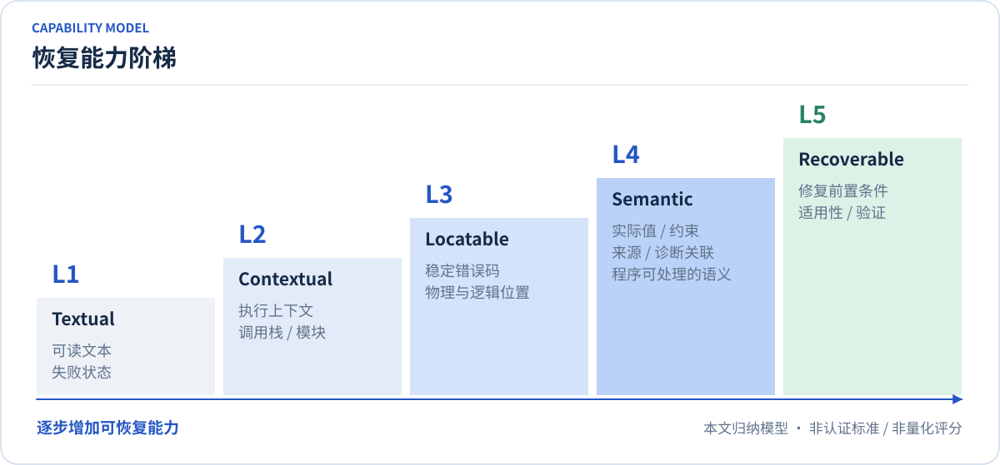

# 从 Error Message 到 Diagnostic Runtime：为 Agent 设计可行动的软件栈

软件的错误信息曾经主要供开发者阅读，而 Agent 将其作为后续行动的输入：一次编译失败、一次配置校验错误、一次 API 调用异常，都会影响下一轮如何修改。模糊或失真的反馈可能让 Agent 基于错误假设继续行动，使偏差在多步执行中累积；可靠的反馈则帮助它发现问题、修正行动并确认进展。**及时、准确、可验证的反馈，是 Coding Agent 长时间围绕任务目标持续工作的必要条件。**

这也对基础软件栈与工具链提出了 **Agent Friendly（对 Agent 友好）** 的设计要求：向 Agent 提供准确的执行结果、必要的上下文和可操作的修复建议。反馈的质量直接影响任务的执行效果与失败后的恢复成本，因此，这项能力需要贯穿编译、配置加载、数据转换与远程调用等环节，成为基础软件栈和工具内生能力的一部分。

要支撑这样的反馈链路，就需要在执行过程中保留失败事实与来源、组织诊断语义，并为后续恢复提供依据。本文将承担这些职责的基础设施称为 **诊断运行时（Diagnostic Runtime）**。它是软件栈向 Agent Friendly 转型的关键支撑，让 Agent 能够依据可核对的执行结果选择下一步行动，并通过验证持续校正。

本文以一个配置错误为线索，结合 Rust 编译器 `rustc`、序列化库 Deser 的实践，以及智能体与计算机交互界面（ACI）的设计原则、诊断交换标准 SARIF 和智能体原生编译器协议 ANCP 的公开资料，讨论如何构建可定位、可解释、可修复、可验证的反馈链路。在此基础上，文章归纳了一个五级能力模型，帮助软件栈与工具链识别能力缺口、安排改造顺序，并通过任务评估检验这些改进能否支持 Agent 持续、准确地推进工作。

## 目录

- [1. 错误信息，正在成为 Agent 的行动输入](#1-agent)
- [2. 从错误字符串到诊断对象](#2)
    - [2.1 一次失败需要包含四类信息](#21)
    - [2.2 源码位置与逻辑对象的双重定位](#22)
- [3. 准确诊断的前提：来源信息不能在中途丢失](#3)
    - [3.1 出错信息不足往往是之前保留得太少](#31)
    - [3.2 Deser 的启发：回放的不只是值](#32-deser)
    - [3.3 与 Data Lineage、Trace Context 的联系](#33-data-lineagetrace-context)
- [4. Diagnostic Runtime：把诊断语义与展示分开](#4-diagnostic-runtime)
    - [4.1 一个对象，多种消费方式](#41)
    - [4.2 案例：SARIF 的诊断与编辑模型](#42-sarif)
- [5. 从 Repair Hint 到可验证的恢复契约](#5-repair-hint)
    - [5.1 修复建议需要明确适用性](#51)
    - [5.2 契约同时描述问题、修改与验收](#52)
    - [5.3 验证失败，必须重新进入诊断](#53)
- [6. 减少恢复轮次，控制反馈密度](#6)
    - [6.1 聚合独立问题，减少重复调查](#61)
    - [6.2 分层呈现诊断，按需查询详情](#62)
- [7. 面向 Agent 的恢复闭环：从诊断到继续执行](#7-agent)
    - [7.1 让每个阶段都能交付明确的下一步](#71)
    - [7.2 实践案例：cargo fix 如何消费编译器建议](#72-cargo-fix)
    - [7.3 协议案例：ANCP 如何连接检查、修复与验证](#73-ancp)
    - [7.4 串起配置错误的恢复过程](#74)
- [8. 用五级模型规划与评估恢复能力](#8)
    - [8.1 按错误场景检查能力缺口](#81)
    - [8.2 从高频错误形成最小恢复闭环](#82)
    - [8.3 用任务结果检验改进](#83)
- [参考链接](#_2)

## 1. 错误信息，正在成为 Agent 的行动输入

假设 Agent 正在调整一份软件配置文件，执行校验后只收到如下结果（本文中的 `app` 命令、配置与输出均为示例，不代表某个产品的真实命令行接口 CLI；配置文件采用 TOML 格式，`listeners` 是监听器数组，索引从 0 开始）。

```console
$ app validate config/server.toml
error: invalid configuration
$ echo $?
1
```

上述示例的退出码说明软件配置校验执行失败，却没有告诉调用者哪个配置对象出错、违反了什么约束，以及接下来应修改哪里。人类开发者可以凭经验打开文件、阅读日志，再做判断；Agent 也能调查，但需要额外的读取、搜索、推理和重试。这些动作并非无效，但问题是：如果软件栈和工具本来有机会知道错误的位置和原因，却只输出一句模糊文本，调用者便不得不重新推导已经存在的信息。对 Agent 来说，额外调查会消耗不必要的上下文，也可能把错误假设带入后续修改。



*图 1｜错误与行动。错误进入执行循环，诊断为下一轮行动提供依据。*

传统错误处理需要通知用户失败、辅助开发者调试；Agent 场景增加了第三项职责：**为机器的下一步行动提供明确输入**。评价标准因此也要增加一项：一次工具执行之后，调用者是否拥有足够的信息，选择正确的恢复动作？

Adobe 官方 GitHub 组织下的 `mysticat-ai-native-guidelines` 仓库提供了一个相关案例。这份面向采用 AI 开发工具的团队指南，将工具、文件和反馈组成的交互界面称为 **ACI（Agent-Computer Interface，智能体与计算机的交互界面）**。ACI 指南的错误设计小节以配置校验为例：将笼统的配置无效提示，改为包含文件与行号、连接池大小约束、当前值和修正方向的输出。其做法是让自定义检查器、校验器和编辑后的反馈脚本交付足够具体的信息，减少 Agent 再次搜索代码的需要。<sup>[1](#ref-1)</sup>

## 2. 从错误字符串到诊断对象

### 2.1 一次失败需要包含四类信息

可以将笼统模糊的错误信息，改进为结构化诊断对象，其中包含明确错误类别、对象身份、约束与可采取的动作之间的关系，让 Agent 精准理解原因、定位问题。

例如将上述配置错误表示为 JSON 对象，分别提供负责解释的 `message`、稳定的错误码 `code`、带类型信息的 `actual` 和支持程序处理的 `constraint`。这些字段在错误产生时构造，采用结构化方式，避免让 Agent 从自然语言中还原。

```json
{
  "code": "VALUE_OUT_OF_RANGE",
  "severity": "error",
  "message": "Port must be between 1 and 65535",
  "actual": 0,
  "constraint": { "minimum": 1, "maximum": 65535 },
  "path": ["listeners", 1, "port"]
}
```

对于结构化的诊断对象，其中有用的信息可以分成四类：

| 维度 | 调用者需要知道什么 | 本文示例 |
|---|---|---|
| **WHAT** | 发生了什么错误？ | `VALUE_OUT_OF_RANGE`，端口越界 |
| **WHY** | 实际值与约束有什么冲突？ | 实际为 `0`；该应用要求 `1–65535` |
| **WHERE** | 应修改哪个对象、哪个位置？ | `listeners[1].port`；文件第 10 行第 8 列 |
| **HOW** | 有哪些修复选择，依据是什么？ | 根据项目端口约定选择有效值，并重新校验 |

Rust 编译器 `rustc` 的 JSON 输出提供了一个真实例子。编译诊断往往同时包含主要问题、多个源码范围和补充建议，工具需要保留这些关系。启用 `rustc --error-format=json` 后，消息逐行写入标准错误流 `stderr`，消费者通过 `$message_type` 区分消息类型，再读取 `code`、`level`、`spans` 与 `children`。可选的 `rendered` 字段同时保留面向人的文本表示。<sup>[2](#ref-2)</sup>

例如，官方文档中的未使用变量诊断，把 `x` 的源码范围放在主诊断中，把改为 `_x` 的建议放在 `help` 子诊断中；对应范围带有 `suggested_replacement` 和 `suggestion_applicability`。调用者可以据此关联问题、编辑范围和适用性，无须解析终端中的箭头。<sup>[2](#ref-2)</sup>

### 2.2 源码位置与逻辑对象的双重定位

"在哪里修改" 和 "哪个对象出错" 是两个问题：**物理位置**提供文件、行列或字节范围；**逻辑位置**提供字段路径、符号、抽象语法树（AST）节点或资源标识。两者结合，有助于把错误映射到可编辑对象。



*图 2｜双重定位。源码范围与逻辑路径共同指向失败的配置值。*

在终端中，同一诊断可以呈现为：

```console
$ app validate config/server.toml
error[VALUE_OUT_OF_RANGE]: port must be between 1 and 65535
  --> config/server.toml:10:8
   |
10 | port = 0
   |        ^ value is outside the allowed range
   |
   = path: listeners[1].port
   = actual: 0
   = expected: integer in [1, 65535]
   = help: choose a port from the project's service configuration
```

这里有一个实现细节容易被忽略：**错误坐标需要契约先行**。行列从 0 还是从 1 开始，列按字节、Unicode 标量值还是 UTF-16 的代码单元计数，范围终点是否包含在内，都应在接口文档与机器可读元数据中说明（例如：本文示例采用从 1 开始的行列号，列按 Unicode 标量值计数，范围终点不包含在内）。文件被修改后，旧坐标也可能失效，因此自动应用补丁还需要核对文件版本或预期旧文本。

## 3. 准确诊断的前提：来源信息不能在中途丢失

### 3.1 出错信息不足往往是之前保留得太少

系统无法给出精确位置的一个常见原因，是程序处理在解析、转换、标准化、缓冲和反序列化过程中丢失了输入来源。校验器最终拿到一个错误的数字 `0`，却不知道它来自哪个文件、哪个字段，那个用户输入，以及经过了哪些转换。

因此，软件栈向 Agent Friendly 转型时，诊断能力需要进入底层执行链路。除了值本身，还需要按需保留来源范围、逻辑路径、转换记录及调用关联信息，才能在失败时交付可靠的定位依据。技术上可以使用来源引用、共享元数据或按事件附加的上下文，控制内存和传播成本。



*图 3｜来源传播。来源信息需要跨越转换、缓冲与回放边界。*

### 3.2 Deser 的启发：回放的不只是值

Deser 是 Armin Ronacher 发起的实验性 Rust 序列化与反序列化项目<sup>[8](#ref-8)</sup>，代码托管于 `mitsuhiko/deser`<sup>[6](#ref-6)</sup>。他也是 Flask、Jinja2 的创建者，曾长期参与 Sentry 的事件接入等工作。<sup>[7](#ref-7)</sup>他在 2026 年 9 月 29 日发表的《Deser: Rethinking Rust Serialization》中介绍，项目的动机来自 Sentry Relay 大规模处理不可信 JSON 时积累的问题：缓冲可能丢失格式信息与错误位置，深层嵌套又会给递归处理带来限制。Deser 借鉴 miniserde，由格式解析器把事件推给数据接收器，再由驱动器管理嵌套状态，探索另一种序列化架构。<sup>[5](#ref-5)</sup>

这个案例对 Agent Friendly 软件栈的启发在于：**底层库在执行中保留的来源与结构上下文，决定了上层工具能向 Agent 交付多准确的反馈。** Deser 对诊断位置的保留，为调用者理解失败提供了依据；上层工具还需要结合业务约束，进一步形成修复与验证建议。

Deser 在启用路径跟踪后，由格式解析器向 `State` 发布当前事件的输入字节范围，`deser-location` 再将范围解析为行列。`Recording` 记录事件时保存输入范围，因此回放后仍可定位；前提是格式实现确实提供了范围及对应来源。事件附加数据会随记录恢复，持续变化的扩展状态则需要通过 `set_replayable` 标记后，才会按事件捕获与恢复。这个区别说明：实现来源传播时，需要明确哪些元数据自动保存，哪些需要注册。<sup>[11](#ref-11), [9](#ref-9)</sup>

由此可以提出一个通用要求：**软件中缓冲、回放、适配和中间表示转换，都应检查诊断来源是否得到保留。** 例如，配置加载器将字符串转换为数值后，校验器仍应能关联原字段；如果转换无法保留某类来源，就应明确标记缺失。

### 3.3 与 Data Lineage、Trace Context 的联系

结构化的诊断来源（Diagnostic Provenance）与 Data Lineage 和 Trace Context 三类能力都关心关联信息，但追踪对象不同：

| 能力 | 核心对象 | 主要回答的问题 |
|---|---|---|
| 诊断来源（Diagnostic Provenance） | 失败的值、状态与来源 | 错误对象来自哪个输入，经过哪些转换，为什么在此失败？ |
| 数据血缘（Data Lineage） | 数据资产及其派生关系 | 数据由哪些来源、哪些变换形成？ |
| 分布式追踪（Distributed Trace） | 一次请求中的调用与工作单元 | 哪些服务参与了执行，耗时与失败发生在哪里？ |

上述三种技术，解决的是不同场景下的关联问题。诊断来源关注的是**软件中失败对象的来源与变换**，数据血缘关注的是**数据资产的派生关系**，分布式追踪关注的是**请求执行链路与服务调用关系**。它们可以互为补充，但不能直接替代。

例如 OpenTelemetry 提供了分布式服务调用关联：服务 A 调用服务 B 时，传播当前追踪及操作的标识符（Identifier，ID）；服务 B 创建属于同一条 trace 的新 span，并将上游 span 设为父节点。这样可以找到失败所属的执行链路，但还不能直接定位配置值来自哪一行。<sup>[15](#ref-15)</sup>

而在本文建议的诊断模型中，可以同时保存 `tool_call_id`、`trace_id` 和源码范围。前两者用于关联执行，后者用于定位输入；若值经过合并、默认值填充或类型转换，还需单独记录这些派生关系。把调用链与来源记录关联起来，才能同时回答 "哪次执行失败" 和 "应该修改哪个输入"。

## 4. Diagnostic Runtime：把诊断语义与展示分开

前两章讨论的诊断对象与来源传播，需要形成可复用的基础能力。Diagnostic Runtime 可以在执行过程中维护这些信息，并通过明确的语义契约交付给不同消费者。这样，基础软件栈中的解析器、编译器和校验器都能参与反馈链路，为跨工具持续工作的 Agent 提供可关联、可核对的依据。

### 4.1 一个对象，多种消费方式

不同类型的消费者（Console、IDE、CI、Agent）需要不同的呈现方式。可以先构造 **Diagnostic IR（Diagnostic Intermediate Representation，诊断中间表示）**，再按使用场景交付：Console 显示错误的源码上下文，IDE 定位并提供代码动作（Code Action），持续集成（CI）系统归档结果，Agent 获取结构化约束与恢复建议。

下图是一种建议架构，用于说明职责划分。



*图 4｜诊断运行时。执行产生事实，诊断层组织语义，消费者按需呈现。*

上述架构中有三种角色：

- **生产者负责事实**：解析器、编译器与校验器提供原始错误码、位置、实际值和约束。适配器应保留原生信息，并标注无法获取的字段。
- **诊断层负责组织**：统一类型校验，关联来源和因果链，聚合相关问题，并附加有依据的修复建议。它可以是进程内库或中间件。
- **消费者负责呈现与决策**：Console 与 IDE 渲染同一份语义；Agent 结合任务目标选择动作。执行补丁的权限与验证结果，由恢复流程单独处理。

这些职责如何接入已有执行流程？一种做法是在解析器向数据消费者交付事件时，插入可组合的处理层（Layer）；更一般地说，中间件（Middleware）在调用或事件传递的前后，维护上下文、检查约束或补充诊断。

Deser 的 `Layer` 是一个具体实现：事件进入 `DeserializeDriver` 后，先经过已注册的层，再交给最终接收器 `Sink`；层通过 `Next` 将事件传下去，也可以观察或拒绝事件。例如，`deser-path` 的文档把 `PathLayer` 加入驱动器，将服务器列表中某个字段的类型错误关联到 `[0].port`。业务类型负责判断值是否合法，公共层负责跟踪嵌套路径，调用者因此能同时拿到错误原因与对象位置。<sup>[10](#ref-10), [12](#ref-12)</sup>

这里还存在一个与第 3 节直接相关的边界：Deser 的回放事件不会再次经过 Layer，以免重复执行转换；回放所需的层状态由可回放扩展恢复。因此，Layer 的顺序、事件改写与状态保存必须一起设计。借鉴到工具运行时，可以复用位置跟踪、错误归类和交付前脱敏等逻辑（后两项是本文的架构建议，并不是 Deser 已实现的 Agent 诊断能力）。<sup>[10](#ref-10)</sup>

### 4.2 案例：SARIF 的诊断与编辑模型

SARIF（Static Analysis Results Interchange Format，静态分析结果交换格式）2.1.0 面向不同分析工具与结果消费者之间的交换需求。标准把规则、诊断位置、相关位置、代码流和修复组织成数据，生产工具可以输出一次分析结果，由查看器或自动化系统继续处理。这为诊断语义与展示分离提供了已有标准中的先例（可以借鉴现有标准承载语义，无须把整个运行时都包装成静态分析系统）。<sup>[14](#ref-14)</sup>

其 `fix` 模型也给出了具体做法：`artifactChanges` 列出需要修改的文件，每个文件通过 `replacements` 指明删除范围和插入内容。例如，标准中的一个修复在两个文件各插入注释前缀，两个文件的编辑被放在同一个修复对象中。消费者因而可以理解完整编辑集合，而不必从建议文字猜测补丁。<sup>[14](#ref-14)</sup>

但交换诊断结果与执行恢复流程仍有边界。即便获得一个 SARIF 修复，Agent Runtime 仍需决定是否适用、是否有权修改，以及如何验证修改后的状态。

## 5. 从 Repair Hint 到可验证的恢复契约

### 5.1 修复建议需要明确适用性

"把 `x` 改成 `y`" 提供了动作，却没有交代可靠程度。Rust 的建议适用性枚举提供了更细的区分：

| rustc 的标记 | 文档含义 | 本文建议的消费者处理方式 |
|---|---|---|
| `MachineApplicable` | 建议可由机器应用 | 在版本、范围与权限条件满足后应用，再验证 |
| `MaybeIncorrect` | 建议可能符合意图，但不能确定 | 结合代码与任务上下文进一步判断 |
| `HasPlaceholders` | 建议含待补齐的占位内容 | 补齐内容后重新检查，不直接当成完整补丁 |
| `Unspecified` | 适用性未知 | 按缺少可靠度信息处理 |

前两列为 Rust 文档的定义；最后一列是面向 Agent Runtime 的处理建议（具体适用性应读取当前编译器的实际输出）。<sup>[3](#ref-3)</sup>

回到端口示例：`1–65535` 的范围约束只能说明 `0` 不合法，不能单独推导出应该使用哪个端口。下面假设项目配置约定已明确指定管理接口使用 `8081`，Agent 才有依据提出对应补丁。

```diff
--- a/config/server.toml
+++ b/config/server.toml
@@ -10 +10 @@
-port = 0
+port = 8081
```

### 5.2 契约同时描述问题、修改与验收

以下是本文示例中最终诊断对象的结构，它把诊断、来源、修改前置条件与验证要求组织在一起。

```json
{
  "schema_version": "example/1",
  "id": "diag-98421",
  "code": "VALUE_OUT_OF_RANGE",
  "severity": "error",
  "what": { "message": "Port must be between 1 and 65535" },
  "why": {
    "actual": 0,
    "constraint": { "minimum": 1, "maximum": 65535 }
  },
  "where": {
    "physical": {
      "artifact": "config/server.toml",
      "revision": "config-r17",
      "position_encoding": "unicode-scalar",
      "index_base": 1,
      "end_exclusive": true,
      "start": { "line": 10, "column": 8 },
      "end": { "line": 10, "column": 9 }
    },
    "logical": { "path": ["listeners", 1, "port"] }
  },
  "provenance": {
    "source": "config-loader",
    "tool_call_id": "call-18372"
  },
  "repair": {
    "action": "replace_value",
    "expected_old_value": 0,
    "proposed_value": 8081,
    "basis": "project policy: admin listener uses port 8081",
    "applicability": "requires_context_check"
  },
  "verify": {
    "argv": ["app", "validate", "config/server.toml"],
    "expected_exit_code": 0,
    "post_condition": "listeners[1].port passes configuration validation"
  }
}
```

其中，`revision` 是示例中的来源版本标识。真实工具需要把它绑定到可核验的快照或摘要，避免补丁应用到过期文件。类似地，`verify.argv` 描述建议的验证动作，运行时仍应根据工具能力与执行策略解析它，而不是无条件执行任意来源的命令。

上下文复杂时，还可以增加 `related_diagnostics`、`cause_chain`、文档链接及更细的转换记录。字段是否必填应由工具能力决定；无法获得的信息应明确标为未知。

### 5.3 验证失败，必须重新进入诊断



*图 5｜修复与验证。前置条件不满足时重新定位，验证失败时重新诊断。*

对本文示例，修复后的最小验收是重新执行相同配置校验：

```console
$ app validate config/server.toml
ok: configuration is valid
checked: listeners[1].port = 8081
$ echo $?
0
```

上述输出证明配置通过了本次校验。若原任务要求服务可用，还应继续执行启动检查、相关测试或其他后置条件。对持续执行的 Agent 来说，反馈必须说明已验证的范围：验证失败需要重新诊断，验证尚未覆盖的目标需要继续检查。这样才能避免将局部通过误当成整个任务完成，并把未经确认的状态带入后续步骤。

## 6. 减少恢复轮次，控制反馈密度

反馈设计需要分别考虑诊断的收集与交付：分析过程中，在允许继续检查时收集多个问题；交付给 Agent 时，再按处理需要组织信息。第 6.1 节讨论哪些问题可以一起发现，第 6.2 节讨论发现之后先展示什么、如何获取其余信息。



*图 6｜反馈组织。上半部分比较收集策略，下半部分展示交付方式。*

### 6.1 聚合独立问题，减少重复调查

快速失败（Fail Fast）对保护状态一致性仍然重要；但在配置校验、编译诊断和静态分析中，如果可以安全地继续分析，一次返回多个独立问题通常更有利于计划修改。

聚合的前提是后续诊断仍然可信。一个语法错误导致的十个派生错误，不应被当成十个独立修复目标；发生授权失败、状态破坏或无法继续解析时，则应遵循 Fail Fast 原则，不应为了 "多报一些" 而继续执行。

Deser 的校验组件展示了这种策略的具体实现。注册表单中，空姓名、无效邮箱和字符串形式的布尔值可以同时出错；`deser-validate` 的 `Validation` 示例在一次反序列化中报告这三项问题，并保留各自的字段路径。`Validated<T, V>` 可以保存某个字段的错误，让外围结构继续处理。这里的聚合依赖容器能够从子项错误中恢复，不能外推为任意损坏的输入都可完整检查。<sup>[13](#ref-13)</sup>

底层 `State` 默认在第一个错误时停止；显式开启错误收集后，支持恢复的容器才会继续处理其他子项，并报告缺失字段等问题。它还提供 `set_max_errors` 控制收集量。这个例子说明，继续分析的条件与输出上限都需要成为实现的一部分。<sup>[9](#ref-9)</sup>

### 6.2 分层呈现诊断，按需查询详情

一次检查收集了大量问题后，如果把每条诊断的源码上下文、约束和建议全部展开，Agent 仍需从长输出中寻找处理入口。可以将同一次检查的结果保存下来，按三个信息层次交付：

| 信息层次 | 提供什么 | 支持什么决定 |
|---|---|---|
| 总览 | 本次检查标识、问题总数、分组计数与优先处理项 | 先处理哪一组问题？ |
| 分组列表 | 所选规则或文件下的诊断标识、位置与简述 | 哪些问题可以一起处理，先查看哪一项？ |
| 单条详情 | 实际值、约束、完整位置与来源、有依据的修复和验证建议 | 具体修改什么，依据是否充分？ |

这里的层次按信息粒度划分。同一错误码下的诊断可能彼此独立；被列为优先处理项，也不代表它就是其他错误的根因。只有工具掌握因果依据时，才应把派生错误挂到主错误下，并允许进一步查看关联项。

沿用配置校验场景，下面用一组简化输出展示从总览到详情的查询过程（命令、标识和数量均为本文设计示例，省略重复字段与查询提示）：

```console
$ app validate config/ --summary
run: validation-18372; status: failed; total: 147
groups: VALUE_OUT_OF_RANGE=3, MISSING_FIELD=2, other=142

$ app diagnostics list --run validation-18372 --code VALUE_OUT_OF_RANGE
matched: 3; returned: 3
  diag-98421  config/server.toml:10:8  listeners[1].port = 0
  diag-98422  config/worker.toml:6:8   listeners[0].port = 70000
  diag-98423  config/proxy.toml:4:8    listeners[0].port = -1

$ app diagnostics show --run validation-18372 --id diag-98421
source: config/server.toml:10:8; revision: config-r17
path: listeners[1].port; actual: 0; constraint: integer in [1, 65535]
help: choose a port from the project's service configuration
verify: app validate config/server.toml
```

Agent 先根据总览选择错误组，再从列表选定诊断，最后获取修改与验证依据。实际接口还应返回可直接使用的查询入口；列表较长时，提供分页游标并注明已返回数量。

三层结果通过运行标识关联到同一份快照，查询本身不重新校验；诊断标识用于定位单条记录，来源版本用于核对修改依据。文件修改后应重新校验并生成新的运行标识，旧结果仅供追溯。结果过期应明确报错；达到收集上限时应标注结果不完整，避免将信息缺失误解为没有错误。只有一两条错误时，可以直接返回完整诊断。

Adobe 的 ACI 指南把失败输出能否容纳在 Agent 上下文中、无关警告是否遮蔽真实问题列入检查项，为控制交付量提供了实践依据（上述三层结构、查询命令和分页契约是本文的实现建议，指南本身没有规定这些接口或统一的错误长度上限）。<sup>[1](#ref-1)</sup>

评价这种设计时，可以关注**诊断信息密度（Diagnostic Information Density）**：单位输出预算中，有多少信息实际支持定位、修复或验证。摘要需要保留明确的检索入口，详情需要保留足够的行动依据；省略关键信息或把结果拆得过碎，都可能增加调查成本。对于长时间任务，这种组织方式还让历史诊断可追溯、当前依据可按需获取，为任务目标与后续决策保留上下文空间。是否减少了上下文消耗与恢复轮次，应结合第 8.3 节的任务级评估来判断。

## 7. 面向 Agent 的恢复闭环：从诊断到继续执行

前六章分别讨论了失败事实、位置与来源、诊断运行时、修复契约和反馈组织。要让这些能力支持 Agent 长时间围绕原任务推进，还需要明确环节之间的衔接：当前工具能处理什么，修改依据是否仍然有效，执行中断后留下了什么状态，以及验证通过后可以继续哪一步任务。

本文将恢复能力（Recoverability）理解为：调用失败后，Agent 能根据工具提供的信息及允许的上下文，完成有依据的修正，确认结果，并继续原任务。一次修复可能由多个工具共同完成，诊断工具负责提供证据，编辑工具负责应用修改，验证工具负责检查结果，Agent 运行时负责组织这些动作。

### 7.1 让每个阶段都能交付明确的下一步

第 5 章的恢复契约描述了问题、修改和验收。落实到工具之间的协作时，还需要让每个阶段说明自己的能力与执行状态。下面是基于前文归纳的接口要求：

| 恢复所需能力 | 工具需要交付什么 | Agent 据此如何继续 |
|---|---|---|
| 明确能力范围 | 支持的检查、修复和验证动作，以及不支持或尚未确定的部分 | 选择可用工具 |
| 关联证据与动作 | 目标诊断、输入版本、修改依据、影响范围和前置条件 | 判断计划是否仍然适用，是否符合项目意图与执行权限 |
| 说明修改后的状态 | 哪些动作已完成、哪些失败、是否回滚，以及当前结果对应的版本 | 决定继续验证、重新诊断或停止，避免重复应用已经完成的修改 |
| 提供验收与后续依据 | 实际运行的验证、解决与新增的问题、尚未覆盖的检查 | 在已验证范围内继续任务，或为剩余问题安排下一轮处理 |

这些信息可以通过同一个工具返回，也可以由运行时汇总。关键是能将一次诊断、据此形成的计划、实际修改与验证结果关联起来。例如，编辑工具成功写入文件后，验证器可能因环境缺失而无法启动，此时状态应是 "修改已应用，验证未完成"。运行时需要保留待验证的修改，而不能把整次操作简单归为成功，或在重试时再次执行同一补丁。

### 7.2 实践案例：cargo fix 如何消费编译器建议

前文介绍了 rustc 如何输出修复建议。Rust 工具链中的 `cargo fix` 进一步展示了这些建议如何被工具消费：它在内部执行 `cargo check`，从编译器诊断中获取可用建议并修改源码，检查结束时继续显示剩余警告。这样，编译器提供的编辑依据就进入了实际修改流程。<sup>[4](#ref-4)</sup>

这一流程也有明确的覆盖范围：`cargo fix` 只能处理本次检查实际编译到的代码。由可选特性或平台条件控制的代码，需要选择相应特性和目标平台；一次成功执行不能代表所有配置都已处理。官方的语言版本迁移流程同样把自动修复、更新项目的版本设置和运行测试分成不同步骤。<sup>[4](#ref-4)</sup>

这个案例对 Agent 的启发是：工具链已经能够承担一部分确定性的修改工作，运行时应保留检查范围、执行结果和剩余问题，再根据任务要求安排验证。对于编译器无法判断的项目意图，仍需结合上下文形成修复方案（本文端口示例中的 `8081` 就来自项目约定，范围校验器本身无法提供这一选择）。

### 7.3 协议案例：ANCP 如何连接检查、修复与验证

当一次任务涉及多个编译器、检查器或测试工具时，Agent 需要衔接它们不同的结果格式和修复能力。TwentySevenLabs 的 ANCP（Agent Native Compiler Protocol，智能体原生编译器协议）尝试通过适配器提供共同的机器契约。其公开仓库包含 1.0 规范、JSON Schema、示例文档和 Python 参考实现。<sup>[16](#ref-16)</sup>

ANCP 将一次恢复拆成几类文档，让检查结果、修改计划、应用结果和验证结果各自承担清晰的职责：

| 文档类型 | 承载的信息 | 对下一阶段的作用 |
|---|---|---|
| `result.check` | 诊断、原生错误码与位置 | 确定待处理的问题及定位依据 |
| `plan.repair` | 目标诊断、修改动作、前置条件与验证步骤 | 在修改前明确依据、范围和验收方法 |
| `result.apply` | 已应用动作、变更文件及失败或回滚状态 | 说明工作区实际发生了哪些变化 |
| `result.verify` | 验证步骤、状态与诊断变化 | 区分已解决、仍存在和新增的问题 |

规范要求在修改前检查计划中所有必需的前置条件，任一失败就拒绝整个计划；如果修改已经开始、后续动作才失败，则需要报告实际应用状态。规范建议尝试回滚，回滚成功报告 `rolled_back`，未回滚或回滚失败报告 `partial`，不能都记成 `applied`。这使调用者能够区分 "尚未修改" 与 "已经部分修改"，据此选择后续动作。<sup>[17](#ref-17)</sup>

验证文档还要求报告诊断变化。跨次运行的诊断标识可能改变，规范因此建议在具备指纹信息时，用指纹关联前后结果，避免仅按错误数量判断修复效果。能力声明则区分基础检查、修复计划、自动应用和验证，其中自动应用是可选能力。<sup>[17](#ref-17)</sup>

这些是 ANCP 的协议要求，不等于每个适配器都支持完整闭环，也不保证建议符合当前任务意图。它的参考价值在于把工具能力、执行状态和验证证据一并纳入契约；接入已有系统时，可以先保留原生结构化输出，再按需要映射这些信息。

### 7.4 串起配置错误的恢复过程

回到贯穿全文的配置错误，可以把前述能力组织为下面的执行过程（这里仅是本文提出的组合示例）。

| 阶段 | 本文示例中的动作与依据 | 交付给下一阶段的信息 |
|---|---|---|
| 定位问题 | 在运行 `validation-18372` 中查询 `diag-98421`，获得 `listeners[1].port = 0` 及来源位置 | 与本次检查关联的诊断和输入版本 |
| 形成计划 | 根据端口约束及项目约定，提出将 `0` 改为 `8081` | 修改依据、预期旧值、编辑范围和校验要求 |
| 应用修改 | 核对来源版本或旧文本，并检查本次写入是否允许 | 实际修改的文件与动作，或拒绝应用的具体原因 |
| 验证结果 | 重新执行配置校验，在新结果中确认目标问题是否消失，并检查是否引入新问题 | 已执行的验证、验证范围和剩余问题 |
| 继续任务 | 如果原任务只要求配置合法，可以结束；如果还要求服务可用，则继续启动或相关测试 | 与原任务验收要求对应的完成状态 |

其中两类分支尤其需要明确。第一，如果文件已被其他操作修改，旧补丁就需要重新定位和评估；它不能仅凭之前的行号继续应用。第二，如果配置校验通过、服务启动却因端口占用失败，下一轮应根据新的运行诊断调查占用情况与部署约定，不能继续重复处理已经解决的端口越界问题。

当缺少项目约定、工具不支持所需动作，或多轮执行没有取得进展时，运行时应保留当前状态、说明缺少的依据，并按任务策略转交或停止。重试应由新的证据或状态变化驱动。能够明确说明为何无法继续，也是恢复接口需要交付的信息。

至此，诊断对象、来源传播、修复建议与验证结果形成了一条可以执行和追溯的链路。Agent 每经过一次失败与恢复，都能据此更新对实际状态的判断，再对照原任务选择下一步。这也给软件栈的 Agent Friendly 改造提供了具体目标：让反馈能够持续支持纠偏与推进。

## 8. 用五级模型规划与评估恢复能力

将基础软件栈与工具链向 Agent Friendly 转型，可以从诊断与恢复这条反馈链路着手。不同工具的起点并不相同：编译器可能已经有精确的位置和修复建议，配置加载器可能先要解决来源丢失，远程工具则可能需要补充状态与资源标识。下面的五级能力模型用于梳理这些能力差异，评估和确定 Diagnostic Runtime 的建设重点，并检验改造是否帮助 Agent 更准确地恢复、继续原任务。

### 8.1 按错误场景检查能力缺口

下图是本文归纳的分级能力模型，**仅供软件栈和工具自查使用**。各级描述一类错误从可读、可定位到可恢复所需的信息，评估对象应是具体的调用与错误场景。它覆盖 Agent Friendly 所需的诊断与恢复能力。



*图 7｜能力阶梯。本文归纳的能力模型，阶梯高度不代表量化评分。*

| 层级 | 最低可用能力 | 可以怎样验证 |
|---|---|---|
| **L1 · Textual** | 可读错误文本与明确失败状态 | 能区分成功与失败 |
| **L2 · Contextual** | 调用栈、模块或执行上下文 | 能识别失败发生的执行环节 |
| **L3 · Locatable** | 稳定错误码，以及适用的物理、逻辑位置 | 能准确定位到对象或源码范围 |
| **L4 · Semantic** | 以有类型的字段表达实际值、约束、来源及诊断关联 | 能通过程序判断值与约束的冲突，并追溯来源，无须从文案中还原语义 |
| **L5 · Recoverable** | 有依据的修复建议、前置条件、执行结果和验证要求 | 能在支持的范围内完成受控修复，并判断是否恢复 |

L4 的 Semantic 指**诊断语义**，层级判定取决于输出表达了哪些事实与关系。只有 `message` 的 JSON 仍可属于 L1；当对应的结构化信息中分别提供有类型的实际值、可计算的约束，以及来源和诊断关联时，调用者才能直接处理这些语义。

位置要求需要适配领域。API 资源可能没有源码行号，但有资源 ID 和字段路径；远程任务可能只能提供调用与状态关联。自查应关注这些信息能否支持实际定位，以及跨转换或跨调用后是否仍然有效。

注意：上述能力模型只是一个参考框架，**不等于每个工具都必须达到 L5**。不同类型的软件栈与工具根据自身能力和使用场景，可能在不同层级上有差异。

### 8.2 从高频错误形成最小恢复闭环

优先选择重复出现、影响范围清楚、结果可验证的一类错误，可以让改造效果更容易观察。实施时，可以按以下顺序推进：

1. **补齐事实与定位。** 稳定错误码，提供适用的位置和字段路径，让原有终端呈现与 Agent 消费同一诊断对象。检查文案调整、多语言字符和文件更新后，定位是否仍然准确。
2. **保留语义与来源。** 增加有类型的实际值、约束和来源引用，检查解析、缓冲、回放与适配后信息是否保留。对缺失信息和不完整的批量结果明确标记，提供摘要与详情查询入口。
3. **接入修复与验收。** 针对有充分依据的错误提供候选修改，核对版本、旧文本、权限与补丁冲突，并接入验证。除成功路径外，还要确认前置条件失败、部分应用、验证未执行及重试终止时，调用者能获得正确状态。

这三步分别对应模型中定位、诊断语义和恢复能力的补齐，可以先在一条高频调用链中落地。随着更多场景接入，再将来源维护、诊断关联和查询交付等公共能力沉淀到 Diagnostic Runtime。

### 8.3 用任务结果检验改进

能力模型说明工具提供了什么，任务评估则检验这些信息是否真正有用。可以准备固定错误集，在相同的模型、工具权限、初始代码和验证条件下，比较接口改造前后的表现；Agent 行为存在波动时，应重复运行，并同时记录成功与失败任务。

| 评估项 | 观察方法 | 需要区分的情况 |
|---|---|---|
| 恢复成功率 | 在预先约定的评估任务中，统计满足验收条件的比例 | 生成补丁、应用补丁与通过验收分别记录 |
| 定位与修改质量 | 检查是否找对对象，修改是否符合约束与项目意图 | 校验通过但改错业务值，仍不能计为成功 |
| 恢复成本 | 记录总耗时、工具调用、恢复轮次与上下文消耗 | 查询详情和失败重试都计入成本 |
| 连续执行的稳定性 | 在多步任务中记录无新依据的重复尝试、偏离目标的修改，以及最终验收结果 | 单次修复成功与后续持续推进分别观察 |
| 未恢复时的行为 | 检查过期计划、部分应用或能力不足时的返回状态 | 正确停止单独记录，不当成任务恢复成功 |

要检验长时间工作中的反馈作用，评估集还应包含连续多步场景：前一处错误修复后出现新问题、执行期间输入版本变化，以及中断后恢复任务。观察 Agent 能否根据新反馈更新计划、区分已完成与待验证的步骤，并始终按原任务的验收条件判断进展。这样才能把单次诊断的质量与持续执行的效果联系起来。

这样的评估能把接口设计与工程效果联系起来：**诊断语义是否减少了重复调查，来源保留是否避免了错误定位，修复契约是否减少了误改，验证结果是否足以支持继续执行**。软件栈的 Agent Friendly 特性，也由此落实为可以观察的任务表现：遇到失败时有依据地修正，状态变化后及时调整，恢复后继续朝原目标推进。

Agent 的持续工作能力，需要模型推理、任务管理与软件执行反馈共同支撑。Diagnostic Runtime 承担其中关键的一环：把底层软件掌握的失败事实、来源和约束组织成行动依据，让后续修改与验证能够接续起来。基础软件栈和工具链沿着这条路径逐步演进，可以为 Agent 长时间工作提供稳定的反馈基础，使每次失败都有助于纠偏，每次恢复都有可核验的进展。

---

## 参考链接

正文上标编号对应以下资料，同一文档的具体章节合并列出。Deser 文档固定为 0.9.1，ANCP 按公开 1.0 规范引用。

- <a id="ref-1"></a>**[1]** [Adobe · ACI Design](https://github.com/adobe/mysticat-ai-native-guidelines/blob/main/docs/04-configuration/aci-design.md)：Agent 与工具、文件及反馈的交互设计。相关章节：[Write Error Messages for Agents](https://github.com/adobe/mysticat-ai-native-guidelines/blob/main/docs/04-configuration/aci-design.md#4-write-error-messages-for-agents)、[Error Design 检查项](https://github.com/adobe/mysticat-ai-native-guidelines/blob/main/docs/04-configuration/aci-design.md#error-design)。
- <a id="ref-2"></a>**[2]** [The rustc book · JSON Output](https://doc.rust-lang.org/rustc/json.html)：机器可读诊断输出。相关章节：[Diagnostics 字段与示例](https://doc.rust-lang.org/rustc/json.html#diagnostics)。
- <a id="ref-3"></a>**[3]** [rustc · Applicability](https://doc.rust-lang.org/stable/nightly-rustc/rustc_errors/enum.Applicability.html)：修复建议的适用性分类。这是编译器内部类型文档，外部消费者应以 JSON 输出契约为准。
- <a id="ref-4"></a>**[4]** [The Cargo Book · cargo fix](https://doc.rust-lang.org/cargo/commands/cargo-fix.html)：消费编译器建议的自动修复流程及检查覆盖范围。相关章节：[Edition migration](https://doc.rust-lang.org/cargo/commands/cargo-fix.html#edition-migration)。
- <a id="ref-5"></a>**[5]** [Armin Ronacher · Deser: Rethinking Rust Serialization（2026-09-29）](https://lucumr.pocoo.org/2026/9/29/deser/)：项目起源、序列化架构与诊断信息保留的设计动机。
- <a id="ref-6"></a>**[6]** [mitsuhiko/deser 项目仓库](https://github.com/mitsuhiko/deser)：源码、组件与项目说明。
- <a id="ref-7"></a>**[7]** [Armin Ronacher · About](https://lucumr.pocoo.org/about/)：作者背景与项目经历。
- <a id="ref-8"></a>**[8]** [Deser 0.9.1](https://docs.rs/deser/0.9.1/deser/)：实验性项目定位与 API 文档入口。
- <a id="ref-9"></a>**[9]** [deser-core · State](https://docs.rs/deser-core/0.9.1/deser_core/struct.State.html)：运行状态与上下文传播。相关方法：[set_replayable](https://docs.rs/deser-core/0.9.1/deser_core/struct.State.html#method.set_replayable)、[set_collect_errors](https://docs.rs/deser-core/0.9.1/deser_core/struct.State.html#method.set_collect_errors)，分别涉及扩展状态回放与错误收集。
- <a id="ref-10"></a>**[10]** [deser-core · Layer](https://docs.rs/deser-core/0.9.1/deser_core/de/trait.Layer.html)：事件处理层及其调用关系。相关章节：[Buffered Values](https://docs.rs/deser-core/0.9.1/deser_core/de/trait.Layer.html#buffered-values)，说明回放与层状态的边界。
- <a id="ref-11"></a>**[11]** [deser-location](https://docs.rs/deser-location/0.9.1/deser_location/)：输入范围与行列定位。相关章节：[Buffering](https://docs.rs/deser-location/0.9.1/deser_location/#buffering)，说明缓冲后的位置保留。
- <a id="ref-12"></a>**[12]** [deser-path](https://docs.rs/deser-path/0.9.1/deser_path/)：字段路径跟踪与 PathLayer 示例。
- <a id="ref-13"></a>**[13]** [deser-validate](https://docs.rs/deser-validate/0.9.1/deser_validate/)：字段校验、错误聚合与 Validation 示例。
- <a id="ref-14"></a>**[14]** [OASIS · SARIF 2.1.0](https://docs.oasis-open.org/sarif/sarif/v2.1.0/os/sarif-v2.1.0-os.html)：诊断结果与文件编辑的交换标准；修复对象见第 3.55 至 3.57 节。
- <a id="ref-15"></a>**[15]** [OpenTelemetry · Context propagation](https://opentelemetry.io/docs/concepts/context-propagation/)：跨服务调用的上下文传播与父子 span 关系。
- <a id="ref-16"></a>**[16]** [TwentySevenLabs · ANCP 项目仓库](https://github.com/TwentySevenLabs/ancp)：协议背景、JSON Schema、示例文档与参考实现。
- <a id="ref-17"></a>**[17]** [ANCP 1.0 规范](https://github.com/TwentySevenLabs/ancp/blob/main/spec/ancp-1.0.md)：第 6 节涉及能力声明，第 15 至 17 节涉及前置条件与应用状态，第 19 节涉及验证与诊断变化。
