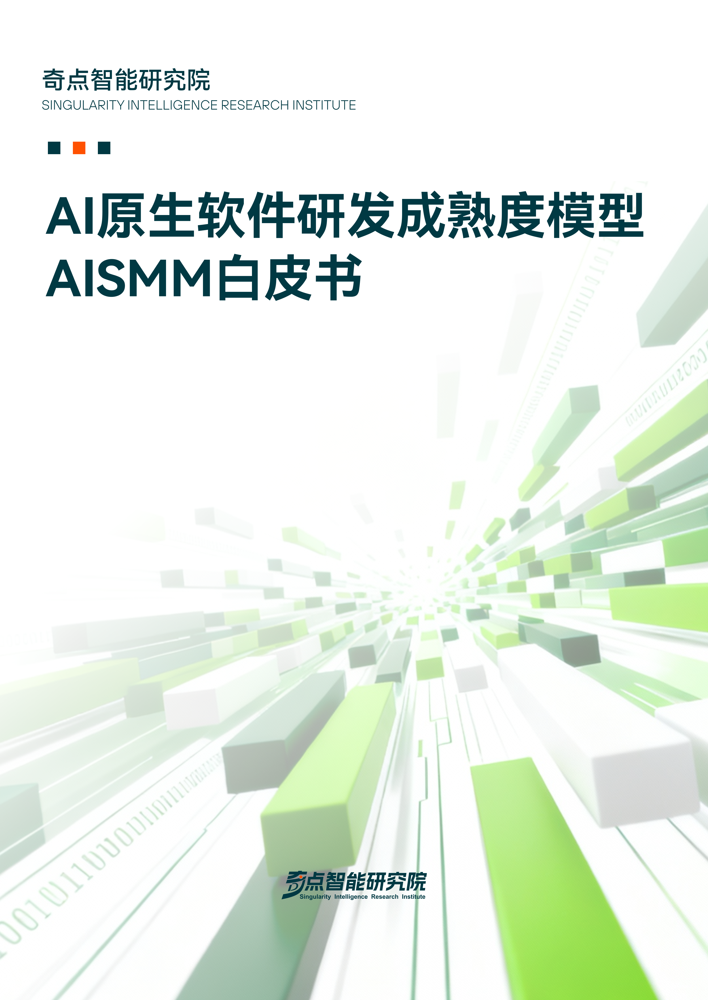
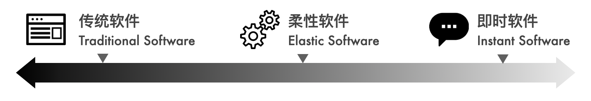

# 柔性的力量，写在《AI 原生软件研发白皮书》发布之际

前段时间有两个新的开源项目比较有意思。

第一个是 [NanoClaw](https://github.com/qwibitai/nanoclaw)，一个轻量级的类 OpenClaw 助手。它的作者开篇就说了一段很有意思的话：OpenClaw 功能很强大，但他 "无法安心地把一个自己不理解的复杂软件接入自己的生活"。于是他自己写了一个替代品，核心代码量极小，只有几个源文件，一个进程跑完。最特别的地方在于它的扩展哲学：不堆积配置项，不往主干上加功能，而是通过 Claude Code 的 Skills 机制，让每个用户 fork 之后，由 Agent 根据自己的需求定制行为。它管这叫 "Skills over Features"，翻译过来大致是 "技能优于功能"。想加 Telegram 通道？不需要文档里翻配置项，告诉 Agent 一声，它读代码、改代码，几分钟搞定。这种体验和传统软件 "预定义可配选项" 的逻辑是完全不同的。

第二个是最近很火的由 Nous Research 开发的 [Hermes Agent](https://github.com/NousResearch/hermes-agent)。它的定位是个会 "自我进化" 的智能体。除了常规的 Agent 能力之外，它有一个内置的学习闭环：完成复杂任务后自动创建新的 Skill，Skill 在使用过程中还能持续自我改进。用户可以告诉它 "记住以后回复简洁一些"，它就会把这条偏好固化下来。它甚至能搜索自己的历史对话，建立越来越深的用户模型。更特别的是，Hermes 把这些 "自生长" 出来的 Skills 以标准化格式发布。这意味着一个用户在某个场景下沉淀下来的能力，理论上可以被另一个用户复用。

这两个项目指向了同一种软件形态，在我们奇点智能研究院最新发布的《AI 原生软件研发白皮书》中，我们管它叫 **柔性软件（Flexible Software）**。它不是传统软件那种 "发布即定型" 的东西，也不是 AI 临时生成的 "用完即弃" 的脚本。它在两者之间找到了一个动态平衡点。

## 软件形态的变化

要理解柔性软件的位置，得先看看软件形态本身正在经历什么变化。

过去几十年，软件的基本特点是：软件在发布之前完成主要设计和实现，用户通过预先定义好的界面使用它，通过预先定义好的方式扩展它。变化通过需求、开发、测试、发布的周期进入系统。这条路径支撑了传统的严肃软件领域，它背后是一整套围绕确定性构建的工程体系。

Agent 的崛起让这个共识出现了裂痕。软件不再只是被人类使用的成品，也越来越多地成为被 Agent 理解、调用、修改、拼装和临时生成的材料。由此，软件的能力绑定时机不再只有 "发布前绑定" 这一种方式，而是沿着一条光谱分化出了三种形态。

在光谱左端，是**传统软件（Traditional Software）**：关键能力在发布前完成定义与实现，强调的是确定性、可预期、可审计。金融交易系统、数据库内核、系统软件，这些对正确性有极致要求的系统仍然依赖这种形态。

在光谱右端，是**即时软件（Instant Software）**：由 Agent 按需生成，用完即弃。临时数据处理脚本、一次性分析页面、探索性原型，这类软件的生命周期往往从几分钟到几天不等。它的存在逻辑是：对这类需求来说，生成成本和沟通成本远低于长期维护成本，所以干脆不维护，用完就扔，下次要的时候再生成一个。

有趣的事情发生在光谱的中间地带。绝大部分真实的业务系统，既不像传统软件那样完全锁定，也不像即时软件那样完全放弃长期结构。它们身上同时存在 "确定性强、不能随便动" 的部分和 "变化频繁、需要灵活适配" 的部分。**柔性软件** 就是为这个中间地带而生：它把系统内部不同性质的能力区分开来，把高确定性、强约束的部分固化在稳定核心中，把高频变化、强个性化适配的部分放到运行时再绑定。

打个比方：传统软件像一栋固定户型的水泥建筑，即时软件像临时搭的帐篷，而柔性软件像一栋框架结构加固但内部隔墙可变的建筑：承重墙不能动，但房间怎么隔、家具怎么摆，可以搬进来之后再决定，甚至可以住着住着继续调整。

知道了它是什么，下一个问题是：柔性软件和传统的 "可配置软件" 到底有什么本质不同？

## 柔性软件的特点

柔性软件之所以能成为一个独立的类别，原因在于它背后的扩展逻辑变了。传统软件的扩展性建立在 "设计者预判" 之上：架构师在软件设计阶段预见到可能的扩展方向，在这些方向上预留钩子和接口，用户通过填写配置项或编写插件来定制行为。这种模式在需求稳定时运作良好，但当变化方向和速度超出预判范围，预设的接口就成了限制。实际工程中常见的应对策略是不断增加配置项，把所有差异压成参数，最后配置系统复杂到没人能完整理解，这就是所谓的 "配置爆炸"。

柔性软件走了另一条路：它不再依赖人的先见之明来预设扩展点，而是让 Agent 在运行时理解源码和设计意图，然后在清晰的边界内进行定制。这里面有三个关键差异。

第一，**软件对 Agent 是开放的，而非封装的**。传统扩展机制建立在封装之上：内部实现被隐藏，外部通过标准化接口交互。这种方式保护了系统完整性，但也限制了扩展深度。在柔性软件中，源码对 Agent 是可见的，Agent 理解软件的内部结构之后，可以在更深的层面进行定制。这种开放不是无限制的，核心层的代码仍然遵循严格的工程标准，任何修改都需要完整的验证流程；扩展层的代码则享有更大灵活性，Agent 可以快速尝试和迭代。

第二，**交付物不再只是可运行程序**。传统的交付物是二进制、容器镜像、安装包。柔性软件的交付物是一个分层的能力包：核心部分（二进制或 API）加上面向 Agent 的扩展机制（Skills、规则、模板、知识资源、评估样本），甚至包括部分源码。交付对象从 "一个成品软件" 变成了 "一个可以在运行时被继续塑形的能力基座"。用户拿到的不是一个功能固定的工具，而是一个可以持续贴合自己需求生长的系统。

第三，**Agent 的角色从外部工具升级为运行时能力的一部分**。在传统软件中，Agent 主要参与研发辅助。在即时软件中，Agent 是软件的生产者和消费者。而在柔性软件中，Agent 的角色最为独特：它不仅参与研发，还直接介入软件的使用阶段，承担扩展、定制、编排和适配职责。它不是临时调用一下外部 API 就走，而是成为软件运行时能力体系的有机组成部分。

## 传统软件的柔性化

柔性软件为传统软件在 AI 时代的演进画出了一条渐进路线：从 "能被用" 到 "能生长"，从功能固化的工具走向持续演进的领域 Agent。

**第一步：让软件能被 Agent 使用。**

这是门槛最低的一步。传统软件的设计长期以来主要考虑 "如何让人使用"，界面设计、操作流程、错误提示都是围绕人类用户的认知特点展开的。在 Agent 时代，软件还需要考虑 "如何被 Agent 高效理解和使用"。这并不意味着要推倒重写，而是在现有系统之上增加一层面向 Agent 的操作接口。

实践中两种最常见的做法是 MCP 封装或 CLI 化。MCP 提供了一种标准化的方式，让 Agent 能够发现、理解和调用软件的能力。CLI 化则更轻量：将核心功能封装为符合标准命令行规范的工具，Agent 可以自行探索子命令、按需组合，完成复杂任务。

配套这些接口的，还需要为 Agent 准备 Skills：用 Agent 能理解的语言描述软件的领域概念、典型使用场景、边界约束和最佳实践。这就好比你不光给了 Agent 一把钥匙，还附带了一本使用说明书。这一步的目标是 "Agent 能用"，但软件本身的结构没有根本变化，门槛低、收益立竿见影。

**第二步：让软件能被 Agent 扩展和定制。**

当 Agent 能够稳定地使用软件之后，下一步是让它拥有一定的改造权。这需要做出一个关键的设计决策：把系统中哪些部分对 Agent 开放，哪些保持封闭。

通常来说，交易一致性、核心数据模型、权限与合规边界、关键算法这些属于 "稳定核心"，应该继续以最高的工程标准保障，Agent 不能随意修改。而表达层、报表、用户偏好适配、流程编排、长尾自动化等属于变化部分，可以交给 Agent 在运行时动态定制。

这一步要求在交付方式上做出改变：将 "变化外壳" 部分以源码形式发布，并配套设计 "如何扩展和定制" 的 Skills。Agent 加载这些 Skills 之后，结合对源码的理解，就能按照最终用户的需求进行定制。改动边界由稳定核心的接口契约来约束：Agent 可以在外围自由发挥，但不能越过契约触及核心逻辑。

**第三步：内置推理引擎和 Agent Runtime，成为领域 Agent。**

当柔性化的程度足够深，一个自然的问题会浮现：既然 Agent 已经是软件运行时的一部分了，为什么不干脆把它内置进去？

这就是第三步的潜力空间：软件内部嵌入一个轻量推理引擎和 Agent Runtime，把 AI 能力从 "外部调用" 变成 "原生能力"。当一个企业资源规划（ERP）系统内置了推理能力，它不再只是一个被用户操作的软件，而是一个能理解业务上下文、主动建议优化方案、根据使用模式持续调整行为边界的 "领域 Agent"。

这一步虽然还在路上，但方向是清晰的。Hermes Agent 已经展示了 "Agent 既是智能体又是软件平台" 的双重属性。随着端侧推理引擎越来越成熟，内置小型模型做特定领域推理的成本正在快速下降。未来可能会有越来越多的软件，出于数据隐私的考量和对 AI 能力深度内嵌的追求，走上这条路：把自己从一个静态工具变成一个能在使用中持续演进的领域智能体。

## 对软件工程的影响

柔性软件的出现对软件工程本身带来了深刻影响。

**软件设计从 "空间规划" 扩展到了 "时间规划"。** 过去架构师的核心工作是决定软件由哪些部分组成、模块如何划分、接口如何定义。这些仍然重要，但柔性软件要求架构师还回答一个新问题：每一项能力应该在什么时候被绑定？哪些必须在发布前固定，哪些应该延迟到运行时，哪些只在特定任务发生时才临时生成？这种 "绑定时机决策" 正在成为架构设计的核心判断力之一。

**交付管理变得复杂了。** 当交付物不再是单一的可运行程序，而是一个分层的能力组合（二进制 + 部分源码 + Skills + 规则 + 模板 + 知识资源），版本管理、验收标准、安全审计的复杂度都大幅上升。传统的验收只需要验证静态功能和性能指标，柔性软件的验收还必须验证 Agent 在动态扩展场景下的行为边界和可控性。

**质量保障需要双层模型。** 稳定核心沿用传统的确定性工程方法：单元测试、集成测试、回归测试、性能测试、灰度发布，这些在核心层依然有效。但在扩展层，需要引入新的治理手段：AgentOps（通过可观测性、追踪、评估和护栏让 Agent 的行为符合预期）成为质量保障的必要组成部分。这不是锦上添花，而是柔性软件能成立的基础设施。

**复用和分发方式正在变化。** 传统的软件分发倾向于黑盒：客户端给编译好的二进制，服务端给标准化 API。但柔性软件天然倾向于源码级别的分发和复用，因为 Agent 需要读源码才能理解软件的结构和意图，才能在此基础上进行定制。当代码的生产成本因为 AI 而急剧下降时，源码的商业价值也在相对降低。开源不再只是一种理想主义的选择，而可能成为吸引 Agent 生态和用户社区的有效策略。真正的竞争壁垒，会转移到领域知识中的 Know-Why 和 Know-How、私有化的领域数据和工程化的 Agent 驾驭能力上。

## 柔性的力量

"柔性软件" 这个词听起来可能太温和了，不够颠覆。但回顾软件工程的历史，那些最终真正沉淀下来的变化，往往不是推翻一切的革命叙事，而是在确定性和灵活性之间找到新平衡点的实践。

传统软件工业花了几十年时间，建立起了一套围绕确定性运转的工程体系：需求分析、架构设计、开发测试、发布运维。这套体系不会马上消失，但它需要面对一个它从未认真考虑过的变量：软件在使用阶段仍然可以被 Agent 使用、塑造和改变。柔性软件不是玄妙的新东西，它坦诚地面对这个问题，并且给出了一个务实的回应：把确定的交给工程，把变化的交给 Agent。

也许几年后回看，即时软件的数量会是最大的，毕竟不是每个需求都值得长期维护。但对软件工程这门学科产生最深刻影响的，恐怕会是柔性软件。因为它不选择立场，不站在 "传统" 或 "颠覆" 的任何一边，而是在看似对立的诉求之间，搭出了一条可以双向通行的路。

我们奇点智能研究院最近发布的《AI 原生软件研发成熟度模型白皮书》，也是按这个思路来设计的。它不会是一份 "发布即定稿" 的静态标准，它有稳定的框架和原则，也有可扩展的技术实践和行业案例，会跟着技术演进和行业发展一起往前走，持续迭代和扩展。软件如此，白皮书依然，这都是 AI 时代 "柔性力量" 的展现。
