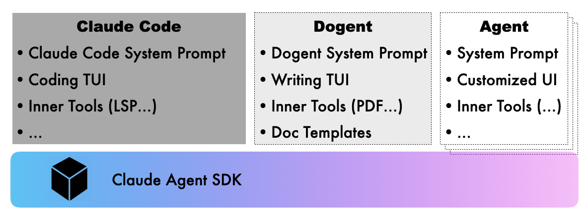
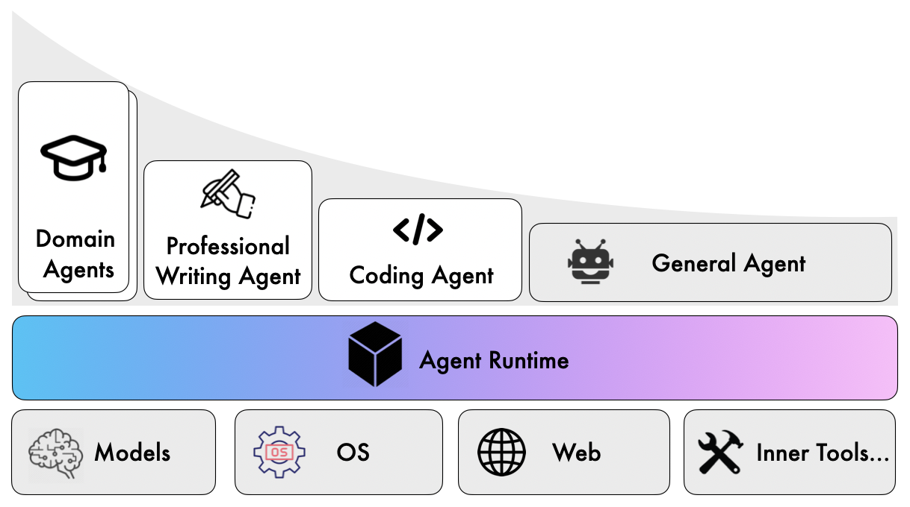

# 动态 Agent 开发：设计挑战与实践洞见

上一篇文章讨论了 AI Agent 时代的技术栈选型光谱，以及 Dogent 为什么选择基于 Claude Agent SDK 开发。这篇文章进入更具体的层面：开发一个动态 Agent 的过程中会遇到哪些设计挑战，以及从中获得了哪些可复用的经验。

这些经验都来自 Dogent 的开发实践，有些可能带有场景偏见。但我相信，随着越来越多人开始基于动态 Agent SDK 构建专用 Agent，类似的问题和解决方案会反复出现。

---

## 技术栈选型：从恰当的 "光谱" 位置开始

前文提到的 AI Agent 时代工具软件开发的技术选型光谱，从 "灵活性" 到 "确定性" 依次排列着：让 LLM 直接 "扮演"、配置通用 Agent "扮演"、基于动态 Agent SDK 开发、静态编排类 Agent、传统确定性程序。Dogent 选择了基于 Claude Agent SDK 开发，技术选型位置在分界点 3。



为什么不直接配置 Claude Code（分界点 2）？写作场景需要的定制程度超出了配置能提供的范围：系统提示词不能完全控制，交互方式（比如大纲编辑器）无法定制，工具集成（比如 PDF 生成、自定义视觉分析）不够深入。

为什么不做成静态工作流（分界点 4）？写作是创造性活动，不同类型文档的写作流程无法预先确定。用户可能随时改变文章结构、插入新素材、调整论证逻辑。整体来说，这是一个难以画成流程图的任务。

动态 Agent SDK 成了合适的选择。它提供了足够的定制空间，又保留了处理不确定性的能力，开发成本介于 "配置" 和 "从零开发" 之间。对于任何一个需要定制系统提示词、交互流程和内置工具集的动态 Agent 来说，这都是一个恰当的平衡点。

---

## Prompt 工程：从指令到知识的转变与平衡

开发动态 Agent 的第一个挑战是 Prompt 设计。在写 Dogent 的过程中，经历过各种提示词的反复调优，收获的第一个重要原则是：**优先提供 Context，而非 Control！** 这和张一鸣在一次演讲中谈到公司治理时说过的观点很类似：[**"Context, not Control"，做 CEO 要避免理性的自负**](https://www.iyiou.com/news/2017042543969)。

Context 在这里可以理解为背景信息或知识，而 Control 则是关于如何做的具体指令。确定性的 Control 指令往往意味着更严格的场景和约束，然而当 Prompt 变复杂、场景和条件变得交错时，各种具体的指令之间就会出现 "矛盾"。

在模型变得越来越强大的今天，这个原则想表达的是：**与其为指令增加更加精细的场景划分和条件补充，不如先尝试提供足够的背景信息和上下文，让模型自己决策。**

注意这里说的是 "优先提供 Context，而非 Control"，而不是 "Context, not Control"。这是因为到底是 Context 优先还是 Control 优先，也是有条件的。准确地说，应该是：**人比 AI 强的地方，让人提供指令；人比 AI 弱的地方，让人提供知识。**

对于我们自己本就是专家的领域，确信自己比 AI 强，那么可以 Control 优先。但遗憾的是，人经常高估自己。所以我的建议是：**先提供知识，发现 AI 做不好的地方再补充指令。**

这是一个逐步和 AI 磨合、能力对齐的过程。一开始你可能不知道 AI 在哪些地方会犯错，所以先给它充分的自主空间。观察它的输出，发现问题后再针对性地添加约束。随着 AI 能力越来越强，指令相对于知识应该越来越少。

---

## 上下文管理：结构分级与状态传递

影响 Agent 使用体验的因素很多，但 "失忆" 无疑是其中最关键的问题之一，例如：

- 在一篇长篇技术报告中，Agent 可能在第 75 页忘记了第 3 页定义的术语，导致同一个概念前后用了不同的表述；
- Agent 在下次重新启动后，忘记了上次任务中的用户输入与历史信息，导致反复的上下文补齐；
- Agent 在偏离后，用户进行了纠正，但下次依旧犯同样的错误，导致用户需要反复提醒。

这不是模型不够聪明，而是上下文管理没做好。解决这个问题需要显式设计上下文管理机制。

对此，Dogent 采用了三级上下文管理结构：

**短期记忆**（`.dogent/memory.md`）记录当前任务的临时信息：正在写的章节要点、刚刚做出的决定、写作过程中文档篇章之间的依赖关系等。任务完成后会清理或归档。

**长期历史**（`.dogent/history.json`）结构化记录所有交互：时间戳、用户输入、Agent 响应、工具调用，全部持久化，用于回溯和分析。

**教训库**（`.dogent/lessons.md`）记录从失败中学习的经验：错误描述、根本原因、解决方案、适用场景。这些经验会在后续任务中自动加载和应用。

这三级结构解决了不同类型的上下文问题：短期记忆保证当前任务的连贯性，长期历史提供回溯能力，教训库支持持续改进。这些文件具有不同的生命周期，用户也可以手动选择归档或清理。

在长文档写作中，还有一类特别棘手的问题：**长文写作往往超出上下文窗口，如何保证语气风格的一致性以及逻辑的连贯性？**

Dogent 的解决方案是：首先对长文进行拆分，然后分篇章撰写，同时使用一个跨篇章的上下文文件，记录整体的撰写计划和进度、篇章概要和依赖关系以及文章文风与重要约束等信息。这个文件会从头传递到尾，任务结束后清除。

这个方案类似软件设计模式中的 Context 模式：在一个多步骤的调度任务中传递一个 context 对象，用于在具体的 Action 之间记录和传递关键信息。它的生命周期从任务初始化创建开始，至全篇章撰写完成、结果整合输出后销毁。作为各子任务之间传递的核心信息载体，它确保拆分后的各写作单元能基于统一的上下文基准完成创作，规避文风割裂、逻辑断层的问题。

---

## Lesson 机制：将纠错反馈转化为可复用资产

静态的系统提示词只能让 Agent 达到基线水平。要持续改进，需要具备从交互中学习的能力。

Dogent 的 Lesson 机制有两种触发方式。

**用户主动记录**：输入 `/learn` 后描述某些经验教训，比如 "技术博客中避免超过三级的嵌套列表，会影响可读性"。这会被记录到 `.dogent/lessons.md`。

**自动触发**：当某项任务失败或被打断后再恢复时，Dogent 会询问用户是否要记录经验。用户提供的信息会被分析并结构化为 Lesson。

这里记录的 Lesson 不是简单的文本，而是结构化的经验：问题描述、根本原因、解决方案、适用场景。这种结构化让 Lesson 可以被程序化地理解和应用。

这个机制的价值在于：**把人对 AI 的纠错反馈从一次性的对话，变成可复用的结构化资产。**

传统的做法是在对话中反复提醒 AI 注意什么，但对话结束后这些提醒就消失了，下次还得重复。Lesson 机制把这些动态提醒持久化下来，形成累积效应。

---

## 交互设计：与人类创作思维的协同

对于 Coding Agent 而言，通过判断代码是否构建成功以及测试是否全部运行通过，可以获得清晰的正向反馈信号。依托这一特性，Agent Loop 可以实现一定程度的自主闭环运转。

而写作则是典型的创造性活动，这类场景下 Agent 没有天然内置的清晰、明确的评估与反馈信号，因此开发一个写作 Agent 就需要在交互设计上下功夫，与人做好协同。

**主动确认而非被动等待**

写作 Agent 的策略应该比 Coding Agent 更 "主动" 一些。当关键信息不足时，Agent 需要主动向用户发起确认，而不是基于猜测继续执行。这种主动性在写作场景中尤为重要：写出一篇不符合预期的长文再推倒重来，代价远比提前主动问清楚要高得多。

**大纲确认与增量修改**

Dogent 在生成文档大纲后，会进入一个专门的确认环节，让用户进行增量调整。这不是简单地问 "大纲可以吗"，而是提供一个可编辑的界面，用户可以直接增删改查各个章节。这种设计基于一个观察：用户往往在看到大纲后才能明确自己真正想要什么，而在当前的交互上下文下能够即时编辑往往效率最高。

**CLI 交互的痛点与应对**

写作过程中，用户需要输入的信息往往更多、更长：补充背景材料、描述修改意图、粘贴参考内容等。传统 CLI 的单行输入模式在这种场景下捉襟见肘：不好换行、不好编辑（选择、复制和粘贴）、不好预览。因此 Dogent 内置了一个轻量的多行文本编辑器，按 `Ctrl+E` 可以调出，支持 Markdown 语法高亮，按 `Ctrl+P` 可以即时预览渲染效果。对于临时的多行输入、信息粘贴、大纲微调这类任务，这个编辑器足够用了。当然，如果是更长篇幅的内容编辑，还是建议打开专门的 IDE 或编辑器。

**文件引用的便捷性**

写作过程中频繁需要引用本地文件或文档模板。Dogent 支持用 `@` 符号引用文件、`@@` 引用模板，这两个快捷方式无论在单行输入还是内置的 Markdown 编辑器中都能使用。这让 "参考这个文件" 或者 "按这个模板来" 的操作变得非常自然。

**用户过程资产的沉淀与复用**

写作过程中，关于如何写好某一类文章，要注意哪些规范，好的输出格式是什么样的？这些是用户沉淀下来的可复用资产。Dogent 提供了文档模板的能力，让用户可以创建、管理和复用这些文档模板。

这些设计决策的背后主要是基于我自己的使用体验：**写作 Agent 的价值不在于能连续生成多少文字，而在于能多好地配合人的创作思维和使用习惯。**

---

## 指令遵从：预先规划与容错性设计

开发 Agent 时有一个持续存在的技术挑战：**如何让 Agent 稳定地返回精准的结构化输出**，尤其在对 Agent 存在多元的输出场景和格式要求的情况下。

这个问题在 Dogent 的开发中反复出现。Dogent 需要 Agent 在不同场景返回不同格式的内容：正常情况下返回纯文本，澄清问题时使用特定的 JSON 格式以便 CLI 渲染成交互式问答，返回文章大纲时使用另一种 JSON 格式以便触发编辑器让用户编辑。

**起初的方案：Tag + JSON 文本协议**

最初的设计是在系统提示词里详细描述格式要求，包括 JSON Schema、示例和注意事项。当 Agent 需要返回澄清问题时，要求它先输出一个特定的 tag（如 `[[DOGENT_CLARIFICATION_JSON]]`），紧跟着是符合 schema 的 JSON 对象。

但 LLM 经常会 "忘记" 或 "违反" 这些要求：例如会在 JSON 前面加一句多余的解释或 Code Block 标签，或者输出的 JSON 格式略微偏离 Schema，或者在思考的 Text 和正式的 Text 中重复输出同样的 JSON，以及多行字符串的转义出错导致 JSON 非法等。

这类问题在 Prompt 场景多、决策树复杂以及上下文负载重的时候尤其严重。Agent 需要同时记住很多规则，而这些规则的边界和优先级可能在某些场景下并不容易判断，加上由于上下文变多的稀释效应，会导致 LLM 的指令遵从效果变差。这对于需要精准结构化输出的场景就是灾难。

要一定程度解决这个问题，经验是：**结构化输出要从一开始就规划。**

LLM 的输出本就是概率性的，天生不能百分之百保证精准的指令遵从。如果各种格式要求都临时往系统提示词里塞，不考虑全局结构的一致性，模型的指令遵循就会很不稳定。尤其当 "后加" 的格式约束与主体 Prompt 是割裂的，模型就容易顾此失彼。

**改进方案一：统一的 JSON Envelope**

与其让模型在 "自由文本" 和 "特定格式" 之间切换，不如要求它的所有回复都遵循统一的顶层 JSON 结构。例如：

```json
{
  "response_type": "normal|clarification|outline_edit",
  "content": "...",
  "questions": [...],
}
```

这样模型不需要判断 "什么时候该用 tag"，只需要填充固定结构的字段，遵循度会好很多。CLI 端也统一走 JSON parser，再根据 `response_type` 分流处理。

**改进方案二：把结构化输出封装成 Tool 调用**

LLM 在训练时对 Tool/Function Calling 的 Schema 有内建的遵循能力，这是模型层面的约束，比 Prompt 层面的约束可靠得多。

因此 Dogent 采用的改进设计是：定义一个 MCP Tool（`dogent.ui_request`），当 Agent 需要向用户发起澄清问题或让用户编辑大纲时，它不是在文本里输出特定格式，而是直接调用这个 Tool，把结构化的 payload 作为工具参数传递。CLI 端根据 tool call 进入相应的交互流程。

这个方案的效果明显好于纯文本协议。工具的 Schema 天然就是格式约束，模型在 "调用工具" 这个动作上的可靠性，远高于 "在自由文本中遵守某种格式"。

**代码层面的容错设计**

即使用了统一的 JSON Envelope 或 Tool Calling，也不能假设模型会 100% 正确。模型能力、上下文污染、网络截断都可能导致非预期输出。因此更高的容错性还需要代码在解析层面设计多级容错：

1. **提前校验**：对 JSON 建立 schema 校验，提前发现问题
2. **容错解析**：尝试从文本中提取符合格式的部分
3. **自动修复**：对常见错误（如尾逗号、单引号）进行修复后重试
4. **重试请求**：校验失败时，返回错误信息让 Agent 重新发起正确的调用

这种防御性设计思维很重要：**不要假设 AI 会完美遵循指令，假设它会犯错，然后设计系统在它犯错时也能优雅恢复。**

---

## 模型能力差异：不同 LLM 在 Agent 中的表现对比

模型本身的能力是影响 Agent 效果的核心因素。由于不同模型的能力侧重点存在差异，在 A 模型上能够顺利运行的 Agent 用例，在 B 模型上未必能够通过。即便都能完成任务，效果和体验也会有明显差别。因此，在切换模型时确实需要进行一定的测试和验证。

Dogent 支持切换多种 LLM API，除了 Claude（包括通过 POE 代理的 Claude API）和 GPT 5.2 之外，也支持国产模型如 DeepSeek V3.2 和 GLM 4.7。

经过对不同 LLM 在 Dogent 中的使用效果进行切换对比，总体而言，Claude 和 GPT 的表现要比国产模型更优。具体体现在：指令遵循效果更好、上下文窗口更大、撰写长文时逻辑一致性更强，以及输出的文章更加细腻生动。

国产模型 DeepSeek V3.2 的指令遵循效果也相当不错，但由于上下文窗口较小（128K），在撰写长文时容易出现上下文不足的问题。此外，DeepSeek V3.2 的输出速度较慢，需要更长的等待时间。

相比之下，GLM 4.7 的输出速度更快，上下文窗口也更大，但其指令遵循效果不甚理想，容易出现不符合系统提示词要求的结构化输出格式问题。

最后，考虑到国产模型访问方便、性价比高，我在本地机器上将 Dogent 默认配置为使用 DeepSeek V3.2 和 Brave 的 Search API。这对于大多数篇幅不长且需要做在线调研的技术文章来说，是一个性价比平衡的方案。而对于需要撰写专业技术长文的场景，我会切换到 Claude。这一需求促使 Dogent 支持为每个项目独立配置模型，并实现一键切换功能，让模型切换变得更加灵活便捷，从而为用户提供更多选择权。

---

## 一些展望：繁荣的 Agent 生态与成型中的 AI Runtime

通过开发 Dogent，我看到一个正在形成的 Agent 生态位与技术分层。

**通用 Agent**（如 Claude Code 本身）解决的是长尾场景。当你需要完成一个不那么常见的任务时，不值得为它专门开发一个 Agent，这时候通用 Agent 的灵活性就体现出来了：它可能不是最优的，但它能用。

但另一方面，Claude Code 或 Codex CLI 这种基于命令行的交互体验和配置，让它们很难走向大众，这就是为什么更通用的、适合一般桌面用户的 Claude Cowork 要出现。后者可能才是一般人意义上的通用 Agent。

**领域专用 Agent**（如 Dogent）解决的是高频、深度定制的场景。这类 Agent 针对特定领域优化了交互方式、工具集成、输出格式，提供更定制的体验。它们存在的理由是：某些场景足够高频、重要以及具有明显的领域差异化，就值得投入开发成本来打磨细节。

这两类 Agent 之间的边界是动态的。**所谓 AGI 的进程，从某种意义上说，就是通用 Agent 逐步能够胜任越来越多领域专用 Agent 场景的过程。** 或者反过来说，**是让领域专用 Agent 的开发成本逐步降低的过程**：当开发成本低到一定程度，"专门开发" 和 "配置通用 Agent" 之间的界限就会模糊。

然而无论上面的 Agent 生态位怎么变，它们会逐步形成稳定的技术分层：在繁荣的 Agent 应用和 LLM 之间出现 **AI Runtime 层**。

AI Runtime 层把稳定的 Agent Loop、LLM 分派、文件读写、工具调用、多 Agent 调度协同的能力封装起来，在不同虚拟隔离空间中推理和执行不同 Agent 应用中的配置规则和技能。



这个 AI Runtime 的特点是什么？

**能力抽象**：它把应用层 Agent 需要的公共能力进行封装（LLM 访问、Agent Loop、输入输出……），让上层 Agent 应用围绕这个内核进行配置和扩展。

**环境集成**：它处理与本地环境的一切交互：文件系统、网络访问、环境感知，向上层应用屏蔽这些细节。

**协议标准化**：MCP（Model Context Protocol）、A2A（Agent to Agent Protocol）、A2UI（Agent to UI Protocol）以及 Agent Skills 这样的协议和规范成为 Agent 对接外部的接口标准，让不同来源的扩展可以即插即用。

这对 Agent 开发者来说意味着什么？

我们可以用 Web 开发来做个类比：AI Runtime 就像是 Web 应用开发中的 HTTP Server（比如 Apache、Nginx）。当 HTTP Server 成熟后，各种的开发框架、工具链都围绕着它建设，应用开发的技术栈因此变得集中和统一。

AI Runtime 也会经历类似的过程：一旦这层基础设施能力和标准稳定下来后，各种开发框架、工具链都会围绕它构建，Agent 开发的技术栈也会趋于统一。

在这个统一的底层之上，类似 DeepWiki、Devin 等 Agent 工具的开发门槛将大幅降低。之前基于各种 Agent Framework 开发的 Agent 应用都值得用新的技术栈重做一遍（成本更低、效果更好）。最终，随着 AI Runtime 的发展、竞争、成熟和稳定，整个 Agent 开发领域或许会迎来一次大规模的重构和升级。
