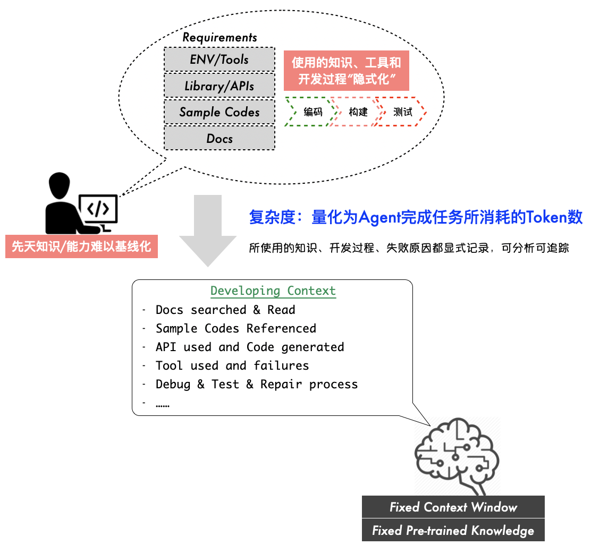
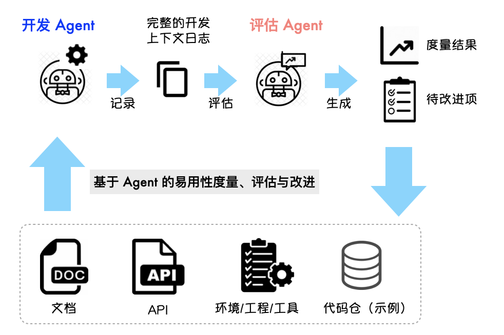
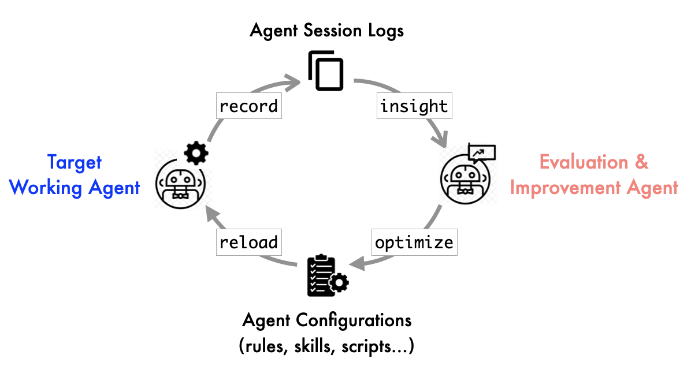

# 从可观测到可进化：基于 Agent 的自动化评估与在线强化范式

> 当 AI Agent 能够完整记录自己的思考和执行过程，那些原本 "只可意会不可言传" 的定性评估问题，终于可以像代码一样被度量、被分析、被持续改进。这不仅是评估方法的革新，更是 Agent 系统从静态优化走向动态优化、从离线学习走向在线强化学习的重要一步。

---

## 一、从易用性难题到显式化评估：让 Agent 成为认知过程的 "显微镜"

去年，我作为技术顾问参与了华为昇腾 CANN 的 Ascend C 算子开发的易用性改进与评估项目。其中的评估工作本身很直接：以第三方顾问视角端到端审视完整的算子开发流程，从工具链安装、查阅文档和示例代码、代码开发、API 调用、构建测试到性能调优，分析其中所有体验不佳的地方，给出一份改进建议清单。

这个过程发现的问题并不意外：文档结构不够清晰、示例代码太复杂、构建时的环境变量配置容易出错、API 设计不够直观...客户认真记录了这些反馈，在接下来的几个月里逐项改进。

但到了今年，问题来了 —— **改进之后效果如何？**

这个看似简单的问题，实际上暴露了传统 "易用性评估" 的根本困境。客户尝试过使用 "典型算子的平均开发人天" 来度量：找一个新入职的工程师，开发一个指定的算子，记录端到端的时间开销。如果去年的版本要 5 天，今年只要 3 天，那说明易用性提升了 40%。

听起来很合理，但操作起来很快就发现很多弊端：

- **人的差异太大**：不同工程师的经验、专注度、解决问题的思路差异巨大，难以建立可信的基线，数据缺乏说服力。
- **过程不透明**：人的思考过程是隐性的，遇到问题怎么解决的、哪里卡住了、为什么绕了弯路，这些信息都 "记" 在大脑里，难以追溯。
- **难以自动化**：每次评估都要组织人、协调时间、记录过程，成本高到不可能像自动化功能测试那样持续集成与验证。
- **改进针对性弱**：只能得到 "整体花了多少天" 这个单一指标，对于具体哪个环节改进了、哪个环节还是短板，结论粒度很粗，难以有效指导具体的优化改进。

本质上，"易用性" 这类指标属于 **定性评估容易、定量评估困难** 的典型。传统的度量方式依赖人的主观感受和隐性认知过程，既难以量化，也难以持续。

### Agent 作为认知过程的 "显式化" 工具

今年合作时,我考虑到：既然现在 AI Agent 这么强，可以尝试让它来扮演这个 "开发者" 的角色，完成端到端的算子开发，同时把整个过程详细记录下来然后用于易用性评估度量?

对于易用性评估，这里有个关键的假设在于：**可以将复杂度量化为 Agent 完成任务所消耗的 Token 数**。



即文档、示例代码、环境配置、构建和测试工程的复杂度，会反映在算子开发 Agent 需要参考的知识量，使用的工具数量，以及失败后的反复重试次数上，最终反映在具体的 Token 消耗上，这些都是 "复杂度" 的量化表现。

于是就有了如下的双 Agent 组合的开发评估系统：

- **开发 Agent**：配置好 Ascend C 开发的规则、技能（如何在线检索文档、如何查阅示例代码、如何使用工具链...），让它像一个真实的工程师一样完成指定算子的开发任务。
- **评估 Agent**：读取开发 Agent 的完整执行日志，分析每个环节的表现，识别失败点、统计重试次数、度量 Token 和时间消耗。

这个方案一运行起来，效果远超预期。

开发 Agent 能够把 **整个开发过程显式记录** 下来：搜索了什么文档、参考了哪些 API、构建失败了几次、哪里卡住了最久、如何解决的环境问题...这些原本 "发生在大脑里" 的隐性思考过程，现在都被完整地记录在 Agent 的执行日志里。

随后，评估 Agent 可以基于这些日志进行 **多维度分析**：

- **整体复杂度**：消耗的 Token 数量和工作时间，可以直接量化任务有多 "烧脑"。
- **环节分析**：哪个步骤失败最多、重试最频繁、耗时最长。
- **问题溯源**：每次失败的原因是什么，是文档问题、API 问题还是工具链问题。
- **改进建议**：基于数据给出针对性建议，比如 "在线搜索准确率太低，建议增加按版本号进行搜索结果分类"。

有了这套自动化评估框架，易用性评估就从一个 "依赖人" 的定性任务，变成了一个 "可自动化、可量化、可持续" 的工程化能力。



这类似针对易用性这个软件属性搭建了一个定制的测试框架，易用性工程师可以持续设计各种不同的测试用例（不同类型的开发任务），让这套系统进行测试并给出测试反馈结果。

基于这套工程，我们对比了 CANN 8.5 版本在易用性上相比 8.3 版本有了哪些具体的进步，以及相比 CUDA 在开发相同算子上还有哪些具体的不足，这些测试都可以低成本、随时执行。

### 从评估工具到可复用资产：Ascend C 开发 Agent 的资产化

通过这套机制的反复运行、观测、分析和优化，不仅可以驱动 CANN 的文档、示例代码、API设计、开发工程的编程体验优化，同时也驱动了 Ascend C 算子开发 Agent 的配置逐渐成熟。

随后，只要把这套配置（规则、子命令、Skills...）打包发布成一个标准的 Ascend C Development Agent Plugin，算子开发者就可以在自己顺手的编码 Agent 助手（Claude Code、OpenCode...）中加载它，获得 Ascend C 算子开发的辅助能力。

在程序员广泛使用 Agent 辅助开发的当下，这样的 Plugin 有着重要价值：

1. **降低入门门槛**：新用户无需从头配置，直接使用优化后的 Plugin，降低了 Ascend C 算子开发的门槛。
2. **提升开发效率**：内置了经过验证的专家经验、最佳实践和优化策略，提高了算子开发和性能调优的效率。
3. **符合时代发展**：通过 Agent 进行 CANN 算子的开发和教学，更符合当前软件编程的范式演进趋势，也更容易被学生群体和新时代程序员所接受。

同时，评估 Agent 的角色也得到扩展：它不仅是度量易用性的工具，更是 **Ascend C Development Agent 的评估和优化工具**，可以持续对官方提供的所有开发界面（文档、示例、API、库、工程、工具...）包括开发 Agent 本身，进行客观度量，识别改进空间，推动持续优化。

### 超越易用性评估：其他可被量化的场景

一旦理解了 "Agent 让隐性过程显式化" 这个核心价值，就会发现它适用的场景远不止易用性评估。关键在于找到那些传统上依赖人的隐性认知、难以量化，但又适合用 "执行 Agent + 评估 Agent" 双架构来模拟和度量的场景。

例如在 **教学效果评估** 中，传统方式往往依赖教师的主观判断：学生到底理解了吗？理解到什么程度？哪些知识点容易混淆？这些问题的答案通常只能通过考试或课堂互动来模糊推断。

而借助双 Agent 模式，我们可以让一个学习 Agent 模拟学生的整个学习过程 —— 阅读教材、完成练习题、提出疑问，同时将每一步的思考、尝试和困惑都完整记录下来。评估 Agent 则分析这些学习日志，量化不同章节的理解难度、学习过程的瓶颈点、常见错误类型，最终给出数据驱动的教学改进建议，比如 "第三章的概念需要更多示例辅助理解" 或 "第五章的练习题难度梯度设计不合理"。

另一个典型场景是 **工作流程合规性审查**。传统审计方式依赖审计人员逐条检查流程文档和操作记录，不仅耗时费力，而且容易遗漏细节。采用双 Agent 模式后，执行 Agent 可以模拟员工遵循特定流程（如财务报销、数据审批）的每一步操作，审查 Agent 则实时分析每一步的合规性、识别风险点、发现效率瓶颈。最终输出量化的合规得分和具体的改进建议，例如 "第 5 步缺少二次确认，存在较高操作风险" 或 "第 3 步与第 4 步之间存在不必要的等待，建议合并优化"。

这些场景的共同特点是：传统上依赖人的经验和直觉，评估过程难以标准化；而过程本身有明确的步骤和规则，可以被 Agent 模拟执行；执行过程产生的日志数据可以被量化分析；基于分析结果可以给出针对性的优化建议。

这套自动化评估的双 Agent 架构的核心价值在于 **将原本 "在大脑里发生" 的隐性过程，变成了 "可以被记录、被分析、被度量" 的显式数据**。这使得定性评估终于可以变成定量评估，模糊判断终于可以变成精确度量。

---

## 二、AgentOps：当可观测性成为 Agent 系统优化的前提

MLOps 的成熟让我们习惯了这样的工作流：训练模型、部署模型、监控模型的性能指标（准确率、延迟、吞吐）、根据数据反馈重新训练。

但 Agent 系统比静态模型复杂得多：

- **多步交互**：Agent 不是一次推理就结束，而是需要多轮决策和工具调用。
- **环境交互**：Agent 会调用搜索、文件系统、编译器等各种外部工具。
- **动态行为**：同样的输入，Agent 可能因为本身的概率性以及上下文不同而做出不同决策。
- **失败模式**：失败可能发生在任何一步，需要追踪完整的调用链。

这些特性使得传统的 MLOps 方法不足以支撑 Agent 系统。正如 [《AgentOps: Enabling Observability of LLM（Large Language Model） Agents》](https://arxiv.org/abs/2411.05285) 这篇论文所指出的，Agent 系统需要一套专门的可观测性框架，用于 **系统化追踪 Agent 的决策和执行轨迹**。

### 可观测性：从传统三要素到 Agent 的动态性需求

在软件工程中，可观测性（Observability）通常通过三个传统维度来实现：**日志（Logging）**、**指标（Metrics）** 和 **追踪（Tracing）**。这套体系对于理解系统 "发生了什么"、"表现如何" 以及 "为什么发生" 等基础问题依然有效，但在 Agent 系统中需要重新审视其内涵。

传统日志记录往往关注孤立的事件，而 Agent 系统更需要捕获 **完整的决策和行为链路**。正如在 [《从 Vibe Coding 到 Agentic Engineering》](https://magicbowen.github.io/thought-archives/%E4%B8%8E%E4%BB%9D%E5%90%8C%E8%A1%8C/%E4%BB%8E%20Vibe%20Coding%20%E5%88%B0%20Agentic%20Engineering/04-vibe-coding-practice/) 实践中所总结的，一个完整的 Agent 可观测性设计需要记录从用户原始输入开始，经过中间决策过程，到最终输出结束的完整事件链：

```
用户原始输入 → 完整 user prompt（模板参数注入后的结果）→ 发送给 LLM 的原始消息 → 接收到 LLM 的决策结果 → Agent 进行消息分解变成的 Action → 不同 Action 的执行结果 → 给用户显示的消息 → 下一个循环...
```

这些记录确保了 Agent 的每个决策环节都是透明的：输入是什么、思考过程如何、执行了什么动作、结果如何。当出现问题时，我们可以像侦探一样追溯完整的证据链，而不是猜测 "可能哪里出错了"。

更重要的是，这种结构化的日志和追踪数据本身也是 **与 AI 沟通的通用语言**。当我们需要另一个 AI Agent 来分析问题或优化系统时，这些数据就是最直接的 "证据"。AI 不需要进行推测和假想，只需要分析日志中的证据链，就能准确诊断问题并提出改进方案。

### 从可观测到可优化：数据驱动的科学决策

可观测性本身不是目的，优化才是。有了完整的可观测性数据，Agent 系统的优化就可以从一个 "凭感觉" 的试错过程，转变为 "基于证据" 的科学决策。

在 Ascend C 开发与评估 Agent 的案例中，这个过程遵循着如下的四步循环：

**第一步: 可观测**

开发 Agent 运行一次完整的算子开发流程，所有过程被详细记录 —— 从用户输入到最终输出，每个决策、每个工具调用、每个成功或失败的结果都被捕获。

**第二步: 可分析**

评估 Agent 读取日志，生成分析报告，识别主要问题点。例如，可能发现 "在线搜索准确率低"、"构建环节失败率高"、"示例代码过于复杂" 等具体问题。

**第三步: 可优化**

基于分析结果，有针对性地优化 Agent 配置和环境。这可能包括：为搜索增加版本索引以提升准确率、在项目模板中预配置正确的环境变量、提供更集中的 API 接口声明等。

**第四步: 可验证**

再次运行开发 Agent 和评估 Agent，对比改进前后的指标。我们不再需要依赖模糊的 "效率提高了"，而是能看到具体的数据变化：Token 消耗显著降低、总时间明显缩短、搜索准确率大幅提升、构建失败率大幅下降。

这就是 AgentOps 的核心价值：**让优化不再是盲目的尝试，而是基于数据的科学决策**。每一次改进都有据可依，每一次优化都有量化验证，形成一个持续改进的正向循环。

---

## 三、从离线优化到在线强化：运行时的动态权重调整

当我们有了可观测的 Agent 系统，一个更有趣的问题出现了：**能不能让 Agent 系统基于这些数据，自动优化自己？**

这听起来有些遥远，但实际上有坚实的理论基础，并且已经有了初步的实践端倪。

### Prompt 作为运行时的 "权重调整"

传统上，我们训练一个模型是离线的、静态的：收集数据、训练、部署。如果模型表现不好，就收集更多数据、重新训练。这个过程成本高、周期长。

但 Prompt 技术的出现，提供了一种 **运行时动态调整模型行为** 的机制。

例如 ["Transmuting prompts into weights"](https://arxiv.org/abs/2510.08734) 指出：**Prompt 的作用相当于对模型权重进行隐式的动态调整**。不同的 Prompt 会激活模型不同的能力子空间，这种调整发生在推理时，无需重新训练。

可以这样理解：

- **传统训练**：静态权重，离线更新，成本高。
- **Prompt 工程**：动态权重，在线调整，成本低。
- **Agent 的 Rules/Skills 配置**：本质上就是运行时的 Prompt 工程。

当你给 Agent 配置不同的系统提示词、不同的工具使用规则、不同的 Skills，实际上是在调整它的 "增量" 权重，编程它的行为模式 —— 但这种编程不是改代码，而是通过改变 Agent 配置来调整模型的 "动态权重"。

### 双 Agent 架构：强化学习的在线版本

理解了 Prompt 作为运行时权重调整的本质，就可以看清楚前面实验中的双 Agent 架构，实际上就是 **强化学习的一个在线版本**。

经典的强化学习范式，通过持续评价反馈进行权重的更新，完成自我优化：

```
环境 → 状态 → 动作 → 评价 → 奖励 → 权重更新
```

而与之对应的双 Agent（目标 Agent 与评估 Agent）架构的强化范式是：

- **环境**：目标 Agent 的环境配置和工具链。
- **状态**：任务的当前进展（包括规划的 TODOs 和 当前进展）。
- **动作**：目标 Agent 的每一步决策和执行细节（详细记录到日志文件中）。
- **评价**：评估 Agent 给出度量指标（Token、时间、成功率、可优化点...）。
- **权重更新**：优化目标 Agent 的 Rules/Skills 等配置（及其背后的脚本）。
- **策略迭代**：改进后重新执行，验证优化效果。

**关键区别在于**：传统强化学习更新的是神经网络的权重（需要梯度反传），而这个范式更新的是 Agent 的配置（Prompt、Rules、Skills...），是 **运行时、低成本、可解释的、人类可审计的优化**。

### 从理论到实践：已有的端倪

这个 "在线强化" 的想法不是空想，实际上在当前的 Coding Agent 中已经有了端倪。

我们看到 Anthropic 的 Claude Code 为此准备的几个关键能力：

- **完整的 session 记录**：每一次开发过程的完整日志，这个能力一直都有，日志一般在 `~/.claude/project` 目录下。
- **Skills 的热加载**：v2.1.0 版本开始支持，无需重启 Agent，动态加载更新后的 Skills 配置。
- **`/insights` 命令**：v2.1.30 版本开始支持，基于用户的对话/使用历史日志，生成诊断报告，给出改进建议。

这三个能力如果闭环打通，就几乎实现了在线强化学习：



1. 工作 Agent 完成任务并记录过程日志
2. 评估改进 Agent 通过 insights 命令分析日志，识别改进点
3. 评估改进 Agent 自动生成或更新 Rules 和 Skills 等配置
4. 工作 Agent 热加载新的配置和 Skills，立即生效
5. 继续工作，验证改进效果，持续迭代优化

社区已经有开发者开始探索这个方向。有开发者在 Reddit 上分享，通过分析 Claude Code 的日志，自动优化 Skills 配置，让 Agent 在特定任务上的表现提升。

### 这一范式的深远意义与适用边界

从离线强化学习到在线强化学习，不仅是技术路径的转变，更是 Agent 系统设计范式的根本升级。这一转变将带来几个层面的深远影响：

- **从 "昂贵训练" 到 "轻量调优"**：传统强化学习是在模型的训练阶段进行耗时的梯度更新，而在线强化范式通过动态调整 Prompt、Rules 和 Skills 配置，实现了运行时低成本优化。这意味着一些 Agent 的改进不再依赖周期性的重新训练，而是可以像软件热更新一样实时生效，大大降低了迭代成本和延迟。

- **从 "人工经验" 到 "数据智能"**：过去，Agent 的优化高度依赖专家的 Prompt 工程和规则设计，本质上是将人的经验编码进配置。而在线强化范式让评估 Agent 基于客观运行数据自动分析瓶颈、生成优化建议，甚至自动调整配置。优化过程变得可量化、可验证，减少了主观偏差，使 Agent 的进化更加科学和高效。

- **从 "通用助手" 到 "专属伙伴"**。通过持续收集用户交互数据并进行在线优化，Agent 能够逐渐适应用户的个人习惯、偏好和任务特点。这种个性化不是靠预设模板，而是通过在线强化自然涌现的，让 Agent 真正成为 "越用越懂你" 的智能伙伴。

- **从 "静态能力" 到 "动态生长"**。在线强化范式使得 Agent 的能力边界不再由初始配置锁定。随着任务执行和环境变化，Agent 可以自主发现新的优化点、集成新的工具、扩展新的技能，实现能力的有机生长。这打破了传统 AI 系统 "发布即定型" 的局限，为 Agent 的长期演进打开了空间。

不过，**并非所有任务都适合这种自动强化范式**。在线强化学习的有效性依赖于一个关键前提：任务的评估可以基于客观数据自动化，无需人的主观价值判断。对于那些高度依赖创造力、审美品味或复杂伦理权衡的任务（例如文学创作、艺术评价、战略决策），评估 Agent 难以给出准确的奖励信号，优化也就无从谈起。

而在大量 **结构化、可度量、评估和改进规则相对明确** 的领域——如软件开发、流程合规性检查、教学效果评估、运维自动化等 Agent 系统——在线强化范式能够发挥巨大作用。它能够带来 Agent 系统的持续自我优化，不断降低错误率、提升效率、适应用户需求，最终实现 "越用越好用" 的良性循环。

当然这里面最具挑战的地方在于能否设计出有效的评价指标和改进策略，这需要具备一定的领域知识和实践经验。

---

## 四、展望：自我进化的 Agent 系统与工程化未来

站在 2026 年初的视角，Agent 技术的发展脉络已经逐渐清晰。一方面，我们可以清楚地看到 **Agent 的长时在线** 和 **多 Agent 协同与集群** 正在走向落地实践。

然而，相比于这些已经 "看得见摸得着" 的架构演进，另一个方向或许蕴含着更大的想象空间：**Agent 通过在线强化学习进行自主迭代**。

正如前文所述，当 Agent 具备完整的可观测性，当评估可以自动化，当优化可以基于运行时数据实时调整，Agent 系统就具备了自我进化、自我适应的潜力。这种进化不再单纯依赖离线训练和版本发布，而是在运行中持续学习、持续优化，甚至能够根据任务和环境的变化自主调整策略和配置。

这种 "自我迭代" 的能力，将把 Agent 从静态的工具转变为动态的、具有 "生命力" 的智能伙伴。它不仅能够完成预设的任务，更能在每一次交互中积累经验、优化策略，逐渐适应用户的个性化需求。**Agent 会越用越 "懂你"，越用越 "顺手"**。

这种个性化、自优化的 Agent 系统，将大大降低工具的使用门槛和适应成本。原来需要用户花费大量时间配置和调教的过程将会自动发生在后台，由 Agent 在使用过程中自动学习、自动改进。而这，或许是 Agent 迈向通用 AGI 的重要一步。