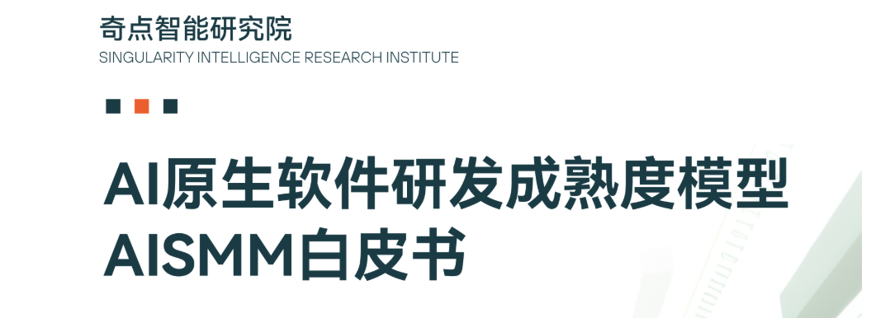

# 你的设计抽象对 Agent 是不是一种负担？

前段时间在一个技术群里目睹了一场有意思的争论。

一方是合作方的 AI Agent 工程师。他认为，软件里的很多抽象对 Agent 是一种负担。小函数、拆文件、抽象接口带来的依赖和跳转，会让 Agent 在写代码时不得不反复查找，才能拼出一段完整逻辑。他的建议是把代码写得 "扁" 一些，减少抽象层次，让 Agent 一目了然。

另一方是我的一名技术顾问同事。他持相反观点：对人好的抽象对 Agent 也同样友好。LLM 的核心能力本来就建立在压缩和抽象之上，高内聚、低耦合的设计对 Agent 同样有价值。

两边都有道理，也都拿出了各自实践中的例子。但我当时觉得，这场争论里还缺一个更根本的追问：

**我们做软件抽象，到底是在解决什么问题？Agent 的出现，改变了哪些前提条件？**

如果不先回答这个问题，讨论很容易变成两种经验的互相否定。一边拿过度设计、层层跳转的代码证明抽象有害；另一边拿高级语言、模块化和领域建模证明抽象必要。它们谈的其实不是同一种抽象。

好的抽象当然有价值。软件本来就站在抽象之上。高级语言是对机器指令的抽象，编译器是对硬件细节的抽象，操作系统是对资源调度的抽象。没有这些抽象，软件工程不可能发展到今天。Agent 也同样站在这些抽象的红利之上。问题不在于要不要抽象，而在于每一层抽象究竟服务于什么目标。

## 软件为什么需要抽象

要判断哪些抽象在 Agent 时代仍然有价值，哪些正在贬值，需要先把软件抽象背后的驱动力拆开。

我倾向于把它分成两类：**面向过程效率的抽象**，以及**面向软件目标的抽象**。

前者解决的是开发阶段的人和组织效率问题。人能理解多少、团队怎么分工、变化如何被局部处理，都会影响代码如何拆分。后者回应的是软件作为产品本身的设计目标。数据一致性、生命周期、资源使用、可靠性和安全边界，这些约束不是因为人类开发者存在才出现，而是软件要承载客户价值时必须面对的问题。

这两个维度在传统工程实践里经常混在一起。一个微服务边界，可能同时是资源弹性的边界、发布生命周期的边界、团队责任的边界，也是领域一致性的边界。过去我们常常希望这些边界尽量对齐，因为这样管理起来简单。但 Agent 进入研发过程之后，其中一部分前提正在变化，所以我们需要重新拆开看。

### 面向过程效率的抽象

第一类抽象来自人的认知边界。

一个函数太长，人很难在脑中完整推演。一个类包含几十个方法，理解成本会急剧上升。一个模块依赖关系混乱，没有人能真正说清楚它的行为边界。于是我们用函数封装一组操作，用模块组织一组能力，用分层架构约束依赖方向。这些做法本质上是在把复杂度降解到人能处理的范围内。

这并不是坏事。很长一段时间里，代码的主要消费者就是人。代码要被人阅读、理解、修改和交接。为人的认知窗口设计结构，是软件工程的基本现实。

第二类抽象来自组织的协作边界。

只要软件不是一个人写的，就会涉及分工。不同的人负责不同模块，不同团队维护不同子系统。当团队之间存在沟通成本时，代码结构就会开始映射组织结构。这就是康威定律描述的现象：系统设计会复制组织的沟通结构。

很多接口和服务边界并不是纯粹的技术需求，而是组织协作的产物。两个团队不想每次改动都开会，于是中间出现一层厚厚的接口隔离。一个公司按照前端、后端、数据团队分工，代码仓库里也自然长出对应的层级结构。它们可能有效降低了人的协调成本，但未必总是软件本身最自然的结构。

第三类抽象来自变化频率的管理。

软件中不同部分的变化频率天然不同。业务规则可能每周都变，底层存储模型可能一年才变一次。如果把高频变化和低频变化的代码揉在一起，每次修改都会扩大影响范围，形成霰弹式修改。于是我们把变化频率不同的部分拆开，让高频变化依赖稳定接口，把不稳定性隔离在较小范围内。

这一类虽然发生在开发过程中，但它不只是为了照顾人。它降低的是修改的爆炸半径，让一次变更可以被独立理解、独立测试、独立交付。这个价值对 Agent 同样重要，甚至更加重要。

### 面向软件目标的抽象

另一类抽象来自软件本身的目标和约束。

先看一致性边界。有些数据必须一起变化。订单和订单项需要保持一致，账户余额扣减和流水记录需要原子完成。这不是审美偏好，也不是为了让代码看起来更清楚，而是业务正确性的要求。DDD 里的聚合根和限界上下文，本质上是在代码中显式表达这种一致性边界。

再看生命周期边界。有些组件需要独立部署、独立升级、独立回滚；有些组件必须随系统整体发布。不同的发布频率、灰度策略和回滚半径，会驱动不同的模块或服务边界。这类边界反映的是交付和运维目标。

还有资源使用边界。推荐引擎可能需要 GPU 弹性扩容，订单服务需要稳定的数据库读写，日志采集需要大吞吐、低优先级的流处理。不同模块对计算、存储和网络资源的需求不同，就需要在架构上保留差异化伸缩和隔离的能力。微服务最初的一个重要价值，就来自这种资源与生命周期差异，而非 “Two Pizza” 的组织结构。

面向软件目标的拆分与抽象并不会因为代码由 Agent 编写就失去价值。Agent 可以帮助我们更快地产生代码，但它不能取消业务一致性、发布生命周期和资源约束。它改变的是研发过程中的消费者和生产者，不是软件交付价值时必须满足的客观目标。

## Agent 的上下文和人的上下文不同

要理解为什么一些抽象在 Agent 面前变得不再划算，关键在于看清 Agent 的上下文机制和人的上下文机制并不一样。

人打开一个文件，可以快速扫读，选择性忽略无关内容。一个有经验的工程师看到函数名、类型名和目录结构，会用已有经验补全很多背景知识。真正进入工作记忆的，通常只是与当前任务相关的一小部分信息。

Agent 不一样。当前主流的 LLM Agent 处理代码时，所有被读取的内容都会消耗上下文窗口。它可以拥有比人更大的上下文窗口，但窗口不是免费的，也不是无限的。文件里的无关内容、长调用链里的每次跳转、框架配置里的隐式依赖，都会变成真实的 token 成本。

这带来几个具体问题。

**霰弹式修改会被放大。** 一个简单需求如果牵连几十个文件、上百处修改，人可以依赖 IDE、经验和选择性注意力逐一处理。Agent 则需要尽量把相关文件加载到上下文里，理解每一处修改的关系，并保持修改前后一致。文件越分散，上下文越拥挤，遗漏和不一致的风险越高。

**跨文件隐式依赖会变贵。** 自动注入、约定优于配置、运行时织入、元编程魔法，对熟悉框架的人来说可能是便利，对 Agent 来说往往是额外追踪成本。一个接口到底绑定哪个实现，一个注解最终触发什么逻辑，一个配置项影响哪个初始化流程，都可能需要多次跳转才能确认。

**人的辅助成本会重新出现。** 当代码组织方式超出 Agent 一次任务可高效处理的范围时，人就需要补充约束、指出相关文件、解释领域知识、提醒哪些地方不能动。Agent 本来是为了减少人的工作量，但如果结构迫使人频繁介入，这部分辅助成本就会抵消它的效率优势。

所以，Agent 并不是不需要结构。更准确地说，它需要的结构和人不完全一样。

当一段代码可以完整落在 Agent 的有效上下文窗口内时，那些仅仅为了降低人类认知负担而做的细碎拆分，可能只是额外跳转。相反，当一个任务天然跨越多个上下文窗口时，清晰的边界、稳定的接口和显式的契约，仍然是 Agent 能够知识隔离和建立导航模型的基础。

抽象的粒度，应该匹配代码消费者的上下文机制。消费者变了，最优粒度也会变。

## 哪些抽象正在贬值

有了前面的区分，就可以逐类审视抽象的价值变化。

### 过度抽象本来就该清理

很多所谓 "对 Agent 不友好" 的抽象，本质上是过度抽象。

过于稀碎而语义不清的函数拆分，为了满足代码度量而强制拆文件，为了使用设计模式而套设计模式，为了未来可能出现的变化而提前制造多层接口。这些做法对 Agent 不友好，但它们对人也不友好。Agent 只是更快地暴露了它们的坏味道。

这一类不需要在 "人友好" 和 "Agent 友好" 之间做选择。它们本来就应该被清理。

### 纯粹面向人的认知减负正在贬值

一些抽象的原始价值，主要是让人能分块理解代码。比如把一段并不复杂的流程拆成很多小函数，再分散到多个文件里；或者把一个 feature 的完整逻辑按照 controller、service、repository、adapter 分散到不同目录。对人来说，这种结构可能符合多年形成的阅读习惯。对 Agent 来说，它可能意味着明明一次可以读完的逻辑，被迫拆成多次跳转。

在《AI 原生软件研发白皮书》的架构讨论中，我们把软件复杂度分成两种：实现复杂度和概念复杂度。实现复杂度是把明确需求转化成可运行代码的难度，概念复杂度是把模糊意图转化成清晰规格并持续保持一致的难度。

Agent 正在大幅压缩实现复杂度。它能更快地产生代码，也能在更大的上下文里理解代码。于是，那些主要为了帮助人类分块消化实现细节的抽象，价值会下降。它们不是一定错误，但需要重新计算收益和成本。

### 纯粹面向组织沟通的边界需要重估

组织边界带来的抽象也在被重新审视。

过去很多模块和服务边界，是为了降低团队之间的沟通成本。A 团队维护一个服务，B 团队通过 API 调用它，双方约定好契约后尽量少互相打扰。这在人的组织里很合理，因为沟通是昂贵的，跨团队协作尤其昂贵。

但当 Agent 可以跨越团队边界阅读和修改代码时，某些中间层的收益会降低。一个接口如果只是为了隔离团队责任，而没有承载一致性、生命周期、资源或变化隔离的价值，那么它在 Agent 时代就值得重新评估。

这并不意味着所有组织边界都会消失。未来多 Agent 协作也需要边界，只是边界的依据可能发生变化。过去边界隔离的是人的职责和沟通成本，未来边界还会隔离 Agent 的上下文、权限和任务责任。新的康威定律可能会出现：软件结构开始映射 Agent 的协作结构，而不只是人类团队的组织结构。

## 哪些抽象依然有价值

抽象不是在 Agent 时代整体失效。相反，有些抽象的价值会更加明确。

### 变化隔离依然重要

如果一项抽象能隔离变化、降低修改的爆炸半径，它对 Agent 仍然有价值。

Agent 最怕的不是文件多，而是一个局部需求会牵出一串分散且不显式的修改。一个好的模块边界，应该让相关变化集中在少数位置，让一次任务能在可控上下文内闭环。稳定接口不是为了制造跳转，而是为了让不稳定实现可以在边界内变化。

换句话说，面向变化频率的抽象不但没有贬值，反而更像 Agent 的安全护栏。它让 Agent 不需要理解整个系统，就能完成一次局部修改，并通过局部测试验证结果。

### 软件设计目标驱动的抽象不会消失

一致性边界、生命周期边界、资源边界，这些抽象不会因为 Agent 的出现而消失。

Agent 不能凭空知道哪些数据必须一起修改，也不能自动取消不同模块对资源和发布节奏的差异。相反，这些边界越清晰，Agent 越容易知道什么可以改、什么不能拆、哪些行为必须保持原子性、哪些服务需要独立验证。

这类抽象承载的是概念复杂度，而不是实现复杂度。实现复杂度可以被 Agent 压缩，概念复杂度不会自动消失。客户需求、业务规则、合规要求、资源约束仍然存在。好的抽象应该把这些约束显式编码到软件结构中，让人和 Agent 都能看到。

## Agent 时代的抽象原则

如果把上述分析落到实践，我们今年发布的《AI 原生软件研发白皮书》里面给出了一些 Agent 时代的抽象设计原则。

**上下文窗口内最小抽象。**

如果一个任务的完整逻辑可以在 Agent 的有效上下文窗口内被加载和理解，就不要为了形式上的整洁过度拆分。一个文件里用清晰的命名、局部函数和必要注释组织完整流程，可能比散落在多个目录中的多层调用更适合 Agent。

这不是鼓励写上帝文件，也不是否定模块化。它只是提醒我们：抽象粒度要匹配消费者的上下文机制。过去为人的短工作记忆设计的粒度，不一定适合 Agent。

**边界处最大清晰。**

跨上下文窗口、跨模块、跨服务的边界，反而要比过去更清楚。接口契约、领域术语、数据一致性规则、错误语义、权限约束，都应该尽量显式。Agent 需要通过边界建立系统地图。含糊的边界会让它在错误的层次上做修改。

**变化隔离优先于认知减负。**

如果抽象能把变化限制在更小范围内，降低霰弹式修改的概率，它就是有价值的。如果抽象只是为了让人看起来更容易分块阅读，却让 Agent 每次修改都要跨文件追踪，那就需要重新掂量。

**显式依赖优于隐式魔法。**

Agent 更擅长处理显式、线性的依赖关系。动态注入、运行时织入、过度约定、元编程技巧，都应该审慎使用。不是说这些技术不能用，而是要意识到它们会提高 Agent 的上下文成本。代码本身是 Agent 最重要的上下文，关键依赖最好能在代码和文档中被直接发现。

## 回到抽象本身

回到开头那场争论。说 "抽象对 Agent 是负担" 的一方，批评的往往是过度抽象、为人的认知边界服务的细碎拆分，以及纯粹映射组织摩擦的中间层。说 "抽象对 Agent 依然重要" 的一方，捍卫的则是软件工程真正有价值的部分：变化隔离、领域边界、一致性约束、生命周期差异和资源治理。

这两种说法并不矛盾。它们只是把不同来源的抽象混在了同一个词里。

Agent 时代真正需要的不是反抽象，而是重新追问每一层抽象存在的理由。它是在降低人的认知负担，降低组织沟通成本，隔离变化，表达领域一致性，还是承载生命周期和资源约束？如果理由依然成立，就应该坚持，甚至要表达得更清楚。如果理由已经随着开发者角色变化而减弱，就应该收敛，避免让 Agent 为历史结构继续付出上下文成本。

好的抽象不会因为 Agent 出现而过时。过时的是那些忘记了自己为何存在的抽象。
